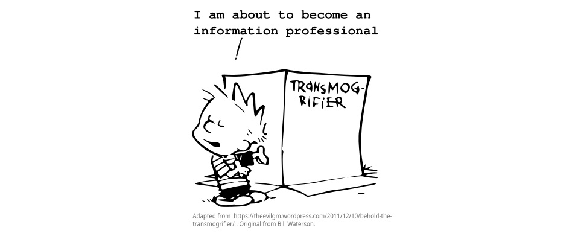

## Week 3 of hopefully 112

I must report that my inner scientist is putting up fierce resistance at this stage. But it's early days.

One of my proudest moments in my first master's degree (I hate that I can say "first master's degree" now) happened when I successfully convinced my supervisors that I should use a continuous measure of **"Extroversion"** instead of dividing my participants into **"Extroverts" and "Introverts"**. Dividing them into groups would have made my code and my life so much simpler, but I WAS RIGHT that doing so would cost me sensitivity. So I did the harder thing and felt highly smug and now it's coming back to haunt me.

Last week, in what felt tantamount to self-betrayal, I found myself splitting continuous data into categories.
But Kendra, it makes sense sometimes. Kendra, if you ask yourself how often you call your cat "Thistle" versus "Beasty", you would rather pick from categories like **"frequently" and "infrequently"** instead of estimating that he's called 'Beasty' with a **frequency of 0.83 times** per day and 'Thistle' with 0.17 times per day."

Fine. Excuse me while I express my inner turmoil.

#### Ode to the loss of variation

All this variation!  
I must tear it asunder 
But how can I kill it? 
This must be a blunder. 

It just wants to be continuous, 
To be correlated, regressed. 
It just wants so badly 
to be at its best. 

But it must be divided. 
It's better, this way. 
More useful, they say. 
More useful, they say.

#### I have made myself a new mantra and I hate it

You will not be analyzing this data. You will not be analyzing this data. You will not be analyzing this data.
