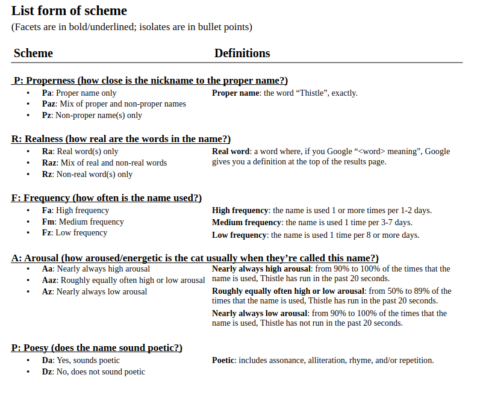
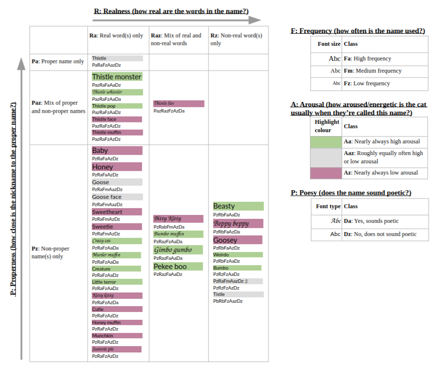
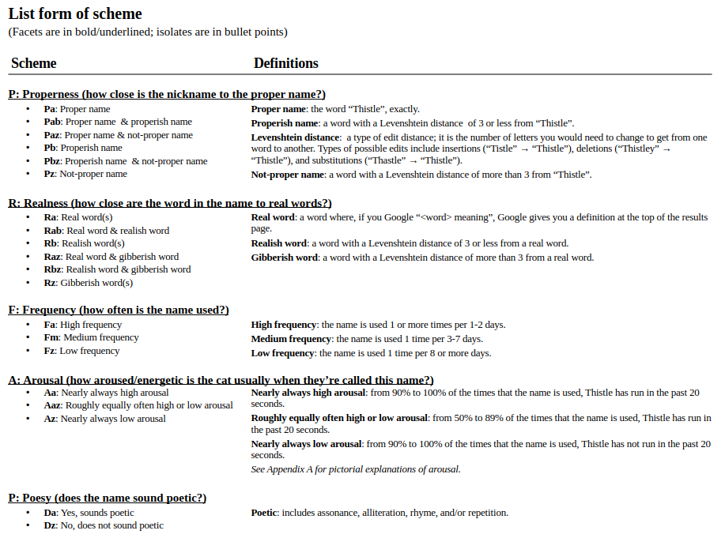
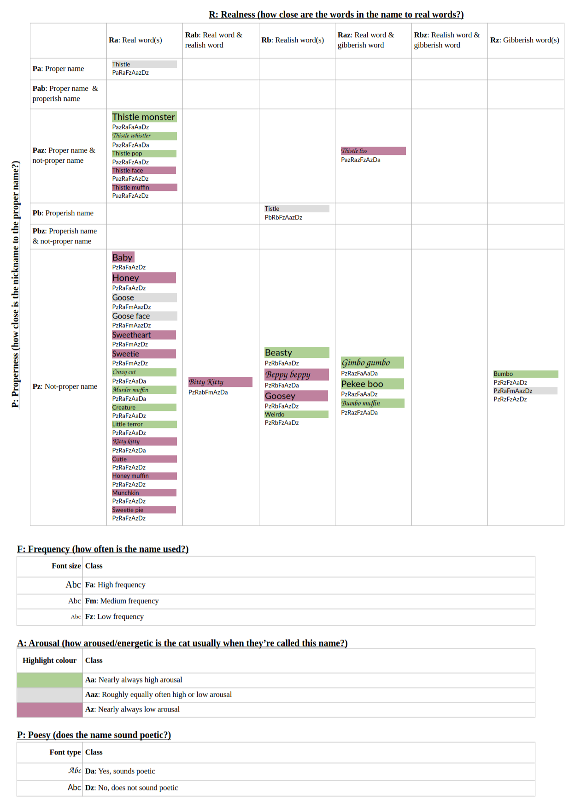

## Creating a faceted classification system for cat names

Thistle does not know his name. He occasionally comes when we make kissing noises (haven't tested if this is a greater-than-chance occurrence). But he's so smart! Why doesn't he know his name? Spoiler: it's our fault.

I'm in a course called *Foundations of Resource Description and Knowledge Organization*. A mouthful. But incredibly fun. You may not believe me if you do not know that I'm the kind of person who, when looking up cozy video games to try, gets excited about the **video game where you get to take stuff out of boxes and put it on shelves**. My favorite job ever was organizing the supply room at an elementary school. Picture this. Paper mayhem. Different colors, weights, sizes, all mixed together, everywhere. Agony. But I BROUGHT ORDER TO CHAOS \**MANIACAL LAUGH*\* (silent maniacal laugh, of course; I struggle to laugh out loud, though sometimes I manage to make guinea pig noises when I'm laughing hard... Maybe picture an evil guinea pig laughing). I made categories. I made labels. I realized I made more categories than cubbyholes. I remade the categories and labels. It was blissful. I am drooling and digressing.

## The assignment

For this assignment, we had to make a faceted classification system for a set of items of our choosing. I initially chose data visualizations, a special interest of mine. I stayed up way too late, my brain exploded, and Colin jokingly suggested I pick something simpler, like names we call our cat. Fine, I will be silly and maybe explode less and be able to sleep. The latter did not happen. I hated and loved it.

This kind of system is supposed to be precise enough that different people would end up at the same classifications if they followed the class hierarchy and descriptions. So I figured, if anyone should be able to do it, it should be automate-able, right? right? wrong. Or at least, I tried and it didn't work and I wasn't willing to put in more effort. I thought making the figure would help me figure out how to make the package, but it is surprisingly hard to automate classifying a name like "Honey" as being used when Thistle is acting cute. Any cat lover who hears me call Thistle "Murder muffin" should be able to guess his energy level, at least. Maybe GPT could do it. But it was too hard for SpaCy's sentiment analysis, which I thought would be a good proxy.

## My faceted classification system

**Use Case.** This system classifies names that my husband and I call our cat. We have just over 30 names for him. I have chosen to limit names to being one or two words long because that includes nearly all the names. That decision also kept the task manageable.

As an extra challenge, I created a data visualization of the scheme.
As someone who has used text-mining methods in research, I am interested in the problem of how to visualize text data.
In addition to using the spatial layout / axes (for the "Properness" and "Realness" facets), I used the text properties of font type (for "Poesy") and font size (for "Frequency"), as well as highlight color (for "Arousal").

## Commentary

<!-- Commentary, as little as two sentences. Can be less polished. Can be candid -->

### Version 1: Initial submission

This was my initial submission for the assignment:

I also included a bespoke data visualization in which I applied the scheme to all of the names I could think of.

### Version 2 (final version above): Addressing fundamental category problems

Personally, I thought the visualization was easier to understand than the list form of the scheme, but my peers found it confusing.
This could be because the main axes of the figure were "Realness" and "Properness", which were the most confusing facets in my system.

Originally, these two facets had **fundamental category problems** because they were addressing multiple questions at once.
Based on a recommendation in the feedback from the instructor, I simplified these categories so each had three options, with

- one isolate being names with **only real** word(s) (or only the proper name),
- one isolate with **real and non-real** words (or the proper name and non-proper name(s)), and
- one isolate with **only non-real** word(s) (or non-proper names).

### Potential future improvements

I have been thinking about whether this still has a fundamental category problem, since there are two pieces of information in some of the isolates.
For example, arguably the isolate *Raz: Mix of real and non-real words* can only be applied after the answer is 'yes' to these two questions:

1. Does the name contain real words?
2. Does the name contain non-real words?

Perhaps I could further simplify the facets to have binary isolates to address this problem.
In "Realness", I could have the isolates "Contains real word(s)" and "Does not contain a real word".
In "Properness", I could have the isolates "Contains proper name" and "Does not contain proper name".
That way, each facet is strictly asking only one question.
