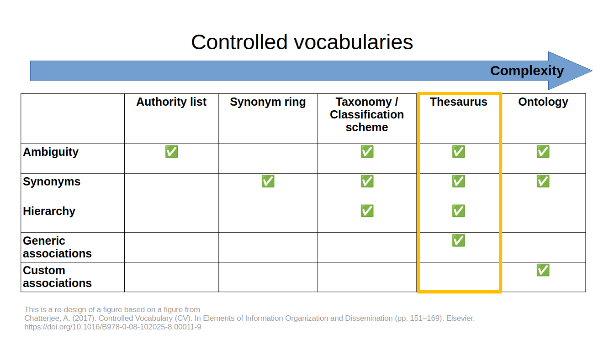
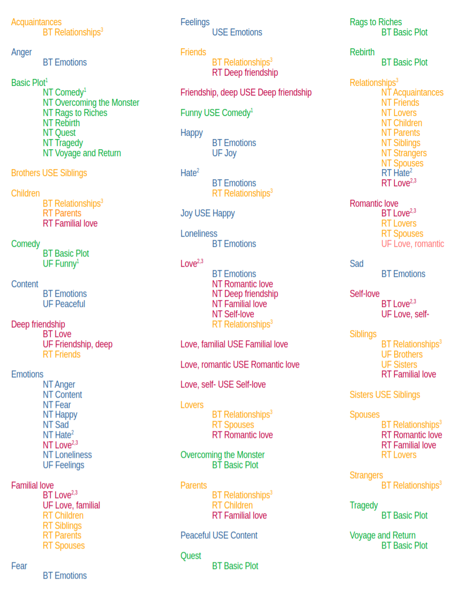
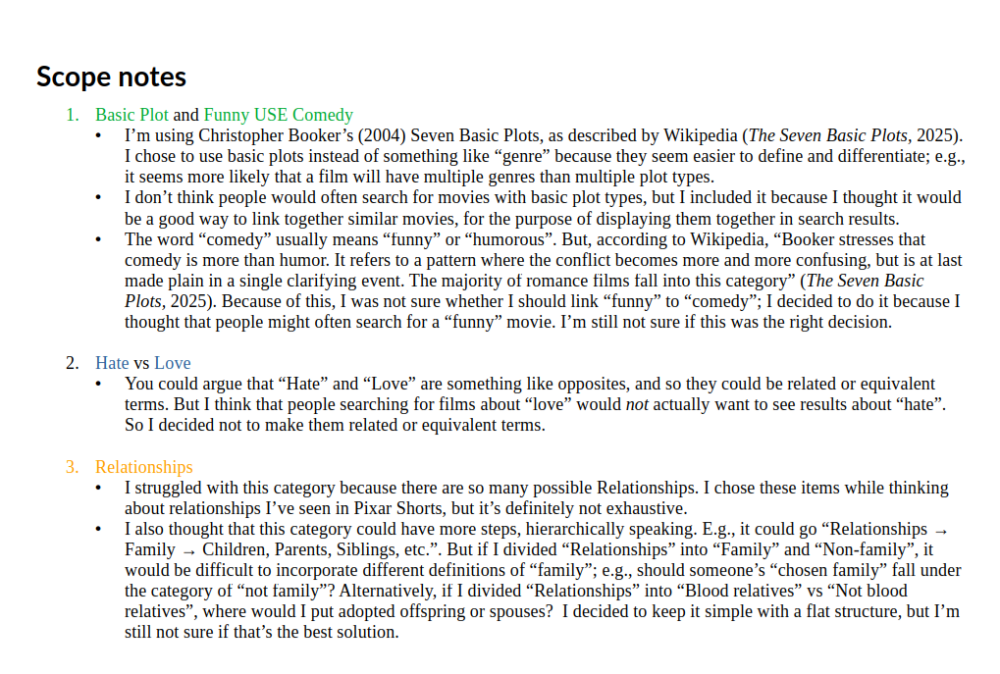
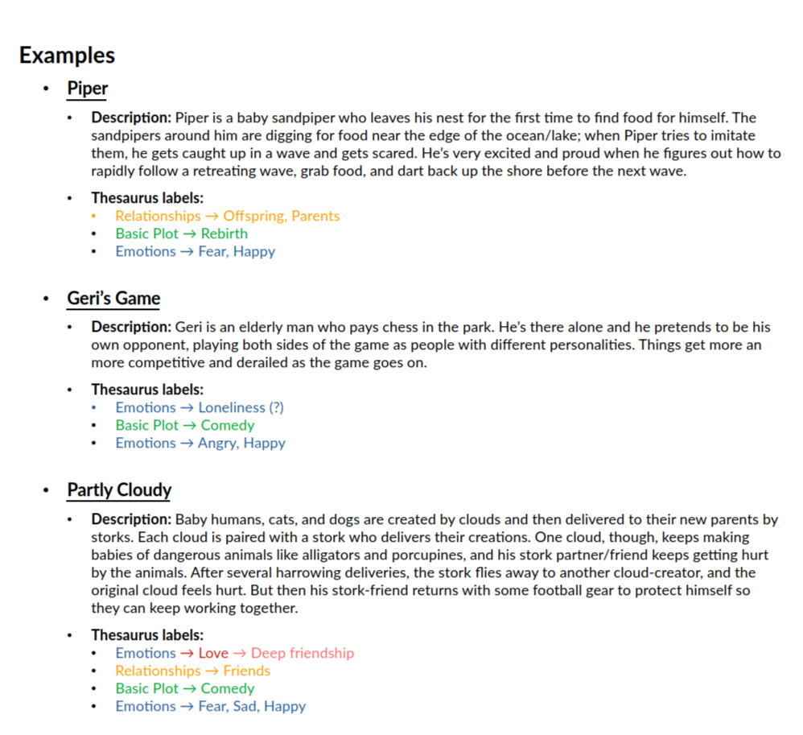

## Creating a thesaurus for Pixar Shorts

In another universe, I am an animator at Pixar.
I fell in love with Pixar, not just through enjoying its films, but mainly through reading a book by one of their founders: "Creativity, Inc." by Edwin Catmull and Amy Wallace.
The book is basically a history of the Pixar company, with a focus on how to organize a company of highly skilled workers with the goal of fostering creativity and satisfaction.
In particular, I loved their concept of the "brain trust", which is basically a group meeting where everyone is encouraged to give candid feedback and put forward wild ideas in a supportive way.
To me, it sounds like a way to take ego out of the creative process.

In the book, Catmull and Wallace emphasize the importance of story -- how a good story can carry faults in all other aspects of the work.
The Pixar Shorts are entertaining and even touching at times, but mostly I appreciate them as studies of story, character, emotion, and relationships.
Imagining myself as a budding animator, I thought it would be useful to have a 'catalogue' of short films that exemplify different plot types, characters, emotions, etc.
Therefore, I decided to make a thesaurus to organize Pixar Shorts so creators could find inspiration for specific goals, such as creating a story about deep friendship or loneliness.

A thesaurus is a type of **controlled vocabulary**; it is a predefined set of terms that a user can select from to find labelled resources. In a thesaurus, the terms and their connections are defined to **control** for ambiguity and synonyms, as well as to define relationships that can help the user expand or narrow their search. The idea is that a user could look at this thesaurus in order to build a set of search terms for a catalogue of Pixar Shorts.

<!-- Here is a chart I made with different types of controlled vocabularies and their features.

 -->

For example, they might want to search for shorts with a 'Comedy' plot type that involves the emotion loneliness; their search might look like this:

`"Comedy"[Basic Plot] AND "Loneliness"[Emotion]`

And their search would return the film "Geri's Game".

## The assignment

The goal of this assignment was to create a small thesaurus.
We were to include three types of relationships:

1. **Hierarchical relationships** to help broaden/narrow the searches as needed.

    - these relationships are indicated with the predicate pair `BT/NT`(Broader Term / Narrower Term)
    - e.g., the entry `Food NT Hamburger` (read as "'Food' has the narrower term 'Hamburger'") and its corresponding entry `Hamburger BT Food` (read as "'Hamburger' has the broader term 'Food'").

2. **Associative relationships** to help broaden searches as needed.

   - these relationships are indicated with the predicate pair `RT/RT` (Related Term)
   - e.g., the entry `Hamburger RT Hotdog` (read as "'Hamburger' has the related term 'Hotdog'") and its corresponding entry `Hotdog RT Hamburger` (read as "'Hotdog' has the related term 'Hamburger'").

3. **Equivalency relationships** to control synonyms, indicating to the user which term they should use when two terms have the same meaning.

    - these relationships are indicated with the predicate pair `USE/UF` (Use / Use For)
    - e.g., the entry `Burger USE Hamburger` (read as "Instead of 'Burger', use the term 'Hamburger'") and its corresponding entry `Hamburger UF Burger` (read as "'Hamburger' should be used for 'Burger'")

Here's a figure I made (based on a more-opaque figure I found in a textbook) that captures where thesauri fit among the various kinds of controlled vocabularies:

### Features of an effective thesaurus

These were the features we were to use to evaluate each other's thesauri:

- **Vocabulary**: terms are suitable.
- **Reciprocality**: each pair of terms is listed twice, so that both sides of the relationship are listed (BT/NT, RT/RT, and UF/USE).
- **Logical coherence**: effective use of different types of relationships (hierarchical vs related) and clear scope.
- **Effect on search**: the thesaurus would help the user in their goals.

## My thesaurus

**Users**: Creators looking for Pixar Shorts to find inspiration for specific goals, such as creating a story/animation about *deep friendship* or *loneliness*.

<!-- first attempt, marked up, or revised version -->

## References

Booker, C. (2004). *The Seven Basic Plots: Why We Tell Stories.* A&C Black.

Chatterjee, A. (2017). Controlled Vocabulary (CV). In *Elements of Information Organization and Dissemination* (pp. 151–169). [https://doi.org/10.1016/B978-0-08-102025-8.00011-9](https://doi.org/10.1016/B978-0-08-102025-8.00011-9)

*Short Films*. (n.d.). Pixar Animation Studios. Retrieved September 24, 2025, from [https://www.pixar.com/short-films](https://www.pixar.com/short-films)

The Seven Basic Plots. (2025). In *Wikipedia*. [https://en.wikipedia.org/w/index.php?title=The_Seven_Basic_Plots&oldid=1284307350](https://en.wikipedia.org/w/index.php?title=The_Seven_Basic_Plots&oldid=1284307350)

## Commentary

### Warrant behind terminology

I spent a lot of time thinking about **warrant** for the hierarchical categories. For example, it seems to me that there is an essential difference between "Interpersonal emotions" like love or hate, and "Personal emotions" like happiness or sadness. You could maybe call these **theory-based categories**. But I chose to merge them into one category of "Emotions" to reflect the way that I think users might think about them; in other words, I chose to prioritize **user warrant.**

Another example of thinking about warrant is in the case of "Basic plots". I used Christopher Booker’s (2004) Seven Basic Plots, as described by Wikipedia ("The Seven Basic Plots", 2025). I felt that plots would be important to creators looking for storytelling inspiration. I decided to use these specific terms, which could be said to have **scientific warrant**, rather than something that would more closely resemble everyday language, because I thought that the users of this thesaurus would probably know something (or be interested in learning) about the theory/research behind plots. If I had made this for any person looking for a movie to watch, I probably would have prioritized user warrant and chosen terms that more closely resemble how the general public talks about plot.

### Understanding reciprocality in an intuitive way

Based on the thesauri that I peer reviewed, I think I grasped the idea of **reciprocality** more easily than others. Maybe this is because I have always enjoyed reading indexes and glossaries in non-fiction books. When reading a textbook about a new subject, I like to look at the index to see which concepts have been listed with the most granularity and the most page references; this helps give me a broad view of the field more effectively than reading the book itself.

I know idexes and glossaries are not the same as thesauri, but in a way, they share the principle of reciprocality in that they usually have preferred terms for **synonyms**. For example, an index/glossary might have the entry "food" with a definition (in a glossary) or page references (in an index), but then the entry "nourishment" may say "see 'food'". If 'nourishment' were only listed under "food", then the user would not find it unless they thought to look under "food" (or they could use a 'search' function on a digital glossary/index). The relationship is often not truly reciprocal, in that they don't often list "nourishment" under "food" as well. But the important thing is that someone who is looking for "nourishment" will find it in its alphabetical place and be directed to "food".

It seemed to me that my peers often had an idea that some terms were more or less important or broad, and it was the more important/broad terms that got their own entries, whereas the narrower/minor terms were only ever listed under one or more broad terms. I'm guessing that full reciprocality can seem unnecessarily redundant and verbose if you don't keep in mind that someone might be looking for each individual term in its alphabetical place.

### Extra challenge: Adding color to see big-picture patterns

I decided to add color to the main categories of terms so that I could try to see patterns in their groupings.
The broadest terms are "Basic Plot", "Relationships", and "Emotions". I also gave a different color to the "Love" category under "Emotions", since that acted as its own broad term. Therefore, most of my thesaurus had only two levels, with the exception being "Love".

One thing I noticed from the coloring was that there were associative relationships between the terms under "Relationships", "Emotions", and "Love", but no connections between the terms under "Basic Plot" and other categories (i.e., the green terms are always isolated from the other-colored terms). Perhaps as a **future improvement**, I could do more research into the basic plot types and see if any types of relationships or emotions are consistently associated with plot types. For example, maybe the "Sadness" emotion is consistently associated with the "Tragedy" plot type, or "Happiness" with "Rags to Riches". This might help users not only learn the conventional combinations of plot types and emotions, but also imagine unusual/creative combinations, like a "Rags to Riches" plot where the dominant emotion is "Anger".

### Change log between my original submission and this version

- Fixed 1 mistake in alphabetization
- Fixed 1 missing reciprocal relationship
- Removed "offspring" as a **preferred term** for "children", since the peer-reviewers thought it not likely that users would prefer "offspring"
- Merged "interpersonal emotions" and "personal emotions", since the division seemed confusing to peer reviewers
