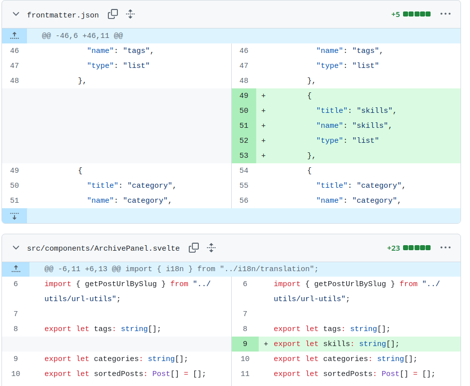
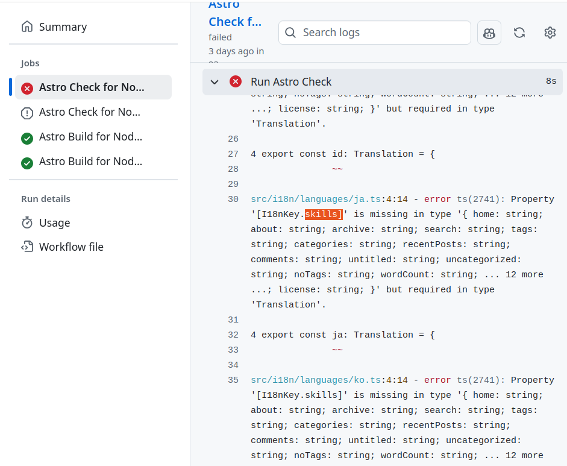
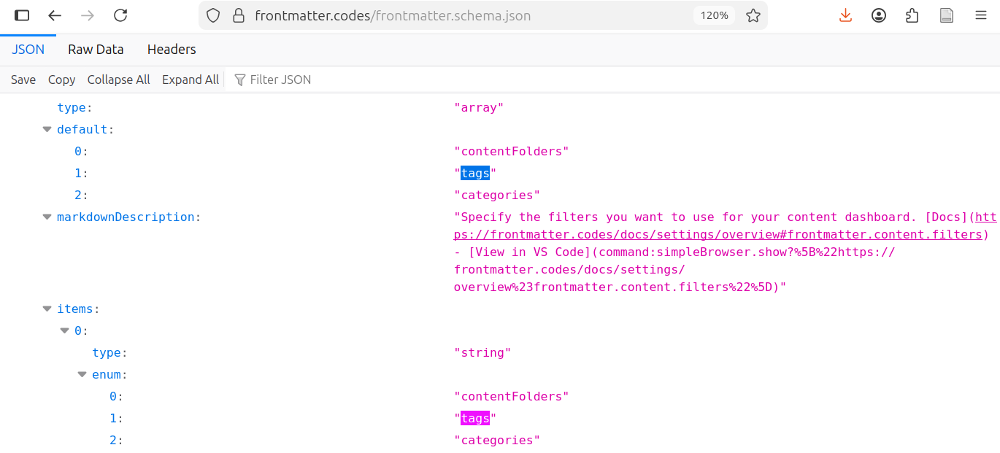
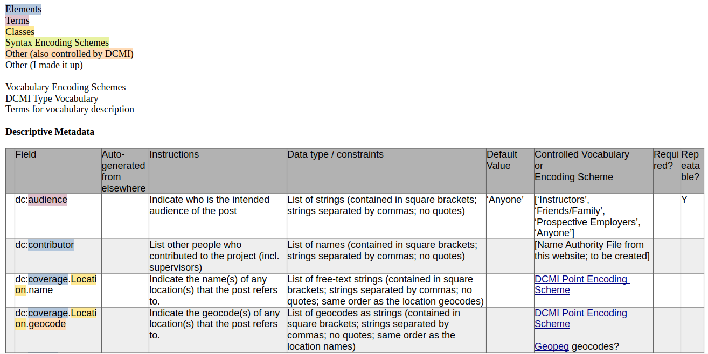
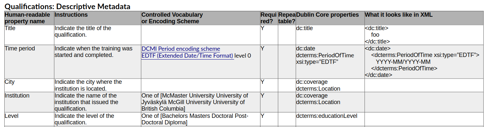
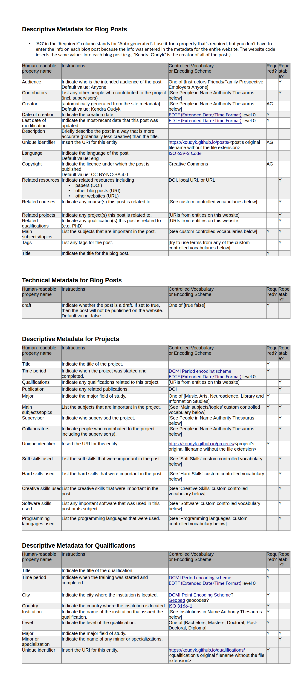

## Creating a content schema for my personal website

<!-- background and purpose in bulletpoints -->

I thought I was being extra efficient by using this assignment to work on my website.
Two birds with one stone, right?

Well, it would have been more efficient if I had not gone down the rabbit hole of the **Dublin Core Abstract Model** and its implementation in **XML**.
I didn't end up using either, in the end.
I blame Jeffrey Pomerantz for making these topics too interesting in his book "Metadata" (which I highly recommend).

## The assignment

For this assignment, we had to create a content schema for any set of resources.
I chose to do it for the blog posts that I write for this website, since I wanted to think more about its design, anyways.

Our content schema was supposed to take the form of a table with the following columns:

- A column for the attribute name,
- A column of instructions for how to fill out the field, and
- A column indicating if the field is required, optional, and/or repeatable.

I expanded this in several ways:

- I divided the last column into two, `Required?` and `Repeatable?`, so I could make them booleans, which I find easier to read quickly.
- I added a column for `Controlled Vocabulary or Encoding Scheme` because I wanted someone to be able to see that information quickly without having to read the full text of the "Instructions" column.
- I added a column called `Example`, to give the user a quick idea of what the data looks like when entered into the file.
<!-- I thought this would be easier to understand than reading things like "list of strings" or "relative path to image file", which requires some technical knowledge. -->

## My content schema

## Commentary

<!-- Commentary, as little as two sentences. Can be less polished. Can be candid -->

I decided to keep my content schema very simple after doing many iterations in which I explored multiple complex sets of descriptive metadata, the Dublin Core Abstract Model, and implementation in XML (see "Version history" below).
It is essentially a summary of the blog-post template that came with the open-source website template that I used.

While all those explorations helped me understand content schemas and data formats, in the end I decided the level of detail I was working with was outside the **scope** of a personal website like this.
The metadata template for blog posts had **sufficient** and **necessary** detail for my purposes.

### Challenges in updating the existing schema for the website template

I only made one change to the existing schema provided with the website template: I divided the attribute `Tags` into `Subjects` and `Skills` (note that the former may still be called `Tags` in my website, if I haven't yet figured out how to change just the display name without introducing an error).
I wanted to differentiate between, for example, specific topics that I have researched (e.g., bird song, neuroimaging) versus skills I've used in that research (e.g., Python, academic writing).
This was quite difficult to implement. Basically, I went through every file that contained the word 'tag' or 'tags', and added a similar section called 'skills'. For example, this screenshot shows some additions I made to the code:

While the website works with this addition, there are some tests on GitHub that are failing because of it.
One of the errors appears to be due to the fact that I did not bother translating 'skills' into the many languages that this template works in. For example, this screenshot is of an error pointing out that I'm missing the Japanese translation of `Skills`:

I think I underestimated how complicated it would be to make changes like this to the website.
I have discovered through exploring the code and learning more about JSON-LD that this website references a 'front matter' schema, which contains entries for `tags` and `categories`:

So, my intuition (without fully understanding web development) is that I also went against this schema when adding 'skills'.

In the future, I may choose to re-build this website with a template that is more bare-bones, so that I can customize it more easily.

### The benefits of creating a schema for myself

After seeing other content schemas for peer-review, I realized that I made my life a lot easier in the end by choosing to make a schema for myself and by choosing a situation where the items are being created along with their metadata.

I don't have to worry about *anyone* being able to understand my instructions because they are only for myself.
Also, I don't have to worry about specifying things like 'how to copy down the title' because the title of the blog posts is generated from the metadata; there is no copying involved. Further, I don't need a name authority file for authors because I am the only author, and that information (along with, e.g., the copyright) is taken from a single place in the code - I don't have to copy it in each time I write a post.

I also do not have to worry about **resolving** the **unique identifiers** for each post; my website **namespace** is unique (`https://koudyk.github.io/`), and the unique identifier of each post is just the URL root plus `posts/` plus the name of the blog-post folder (e.g., `2025-12-01_create-classification_cat-names`).

### Version history

**Version 1: Website template metadata for both posts and projects**.

- I began by creating a content schema for the metadata options for each post available on the website template that I used. Each post is a markdown file that has some YAML-formatted metadata at the top, including the fields `published`, `description`, `image`, `tags`, `category`, `draft`, and `lang`.
- I added the field `project`, and created a separate schema for **projects**. My reasoning behind this was that I would probably create multiple posts for a single project (e.g., my PhD dissertation), and I would want a way to connect them. I also wanted to add a 'page' separate from the homepage where the projects would be listed with links to the posts about them.
<!-- - I made a faceted classification system of 'positions', e.g.,
 -->

**Version 2: Dublin core for descriptive metadata of posts, post-secondary qualifications, and projects**

- After reading about the **Dublin Core Abstract Model** in the book "Metadata" by Jeffrey Pomerantz, I decided to try to fit my website metadata into DCMI. I tried to use all of the Elements, Terms, Classes, and Syntax Encoding Schemes that could be relevant. The idea was that I would later simplify it.
- I created content schemas for the descriptive metadata for Posts, Post-secondary qualifications, and Projects. Here's a screenshot of the first few items in the descriptive metadata for Posts.

**Version 3: Dublin core with implementation in XML snippets**

- I decided that each element needed a human-readable property name, so I re-did the schemas with that as the first column, and specified the Dublin Core properties at the right side of the table, along with what it would look like in XML. Also, instead of colour-coding the different types of properties in Dublin Core, I used the format `dc:date` and `dcterms:PeriodOfTime`. This is what it looked like for the descriptive metadata for qualifications:

- I also removed the `draft` element from the descriptive metadata and put it in a **technical metadata** section

**Version 4 (initial submission): Dublin core in a simplified table**

- I decided to remove the XML implementation snippets for my submission. I figured I might include that in the assignment where I was going to create integrated systems for this website. My initiall submission for the content-schema assignment looked like this:

**Version 5 (final version for this post): Back to the website template's metadata schema for blog posts**

- In the end, I decided to stick with the schema for blog posts that came with the website template. This is because I know that when coding in unfamiliar languages, it is best to start with incremental changes rather than re-designing the entire system from scratch.
- This is the version that I included in my 'Create - Systems Integration' assignment. I received feedback that I might want to further differentiate between `Subject` and `Skill`. I think that made sense at that time because I did't have many skills listed. But I think the distinction will be more clear once I've added posts where I used different skills, such as Python, Git, academic writing, international collaboration, etc. I think that simply having more examples there will make the categories more distinct.
