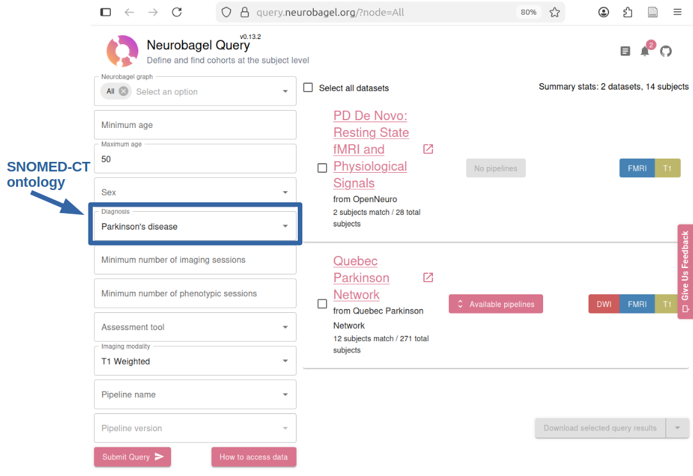
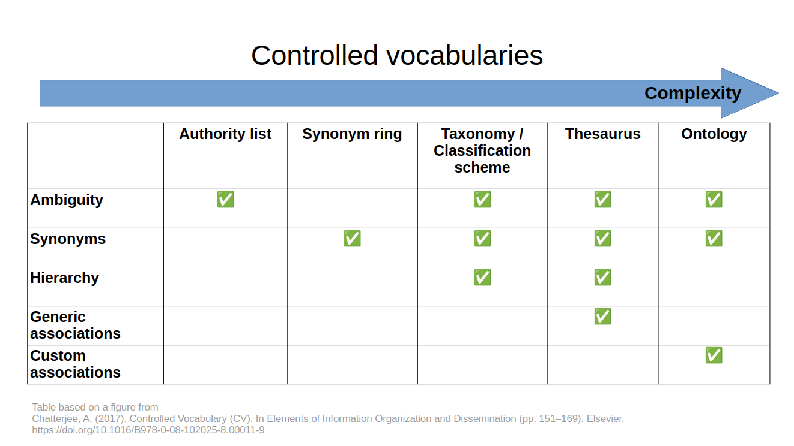
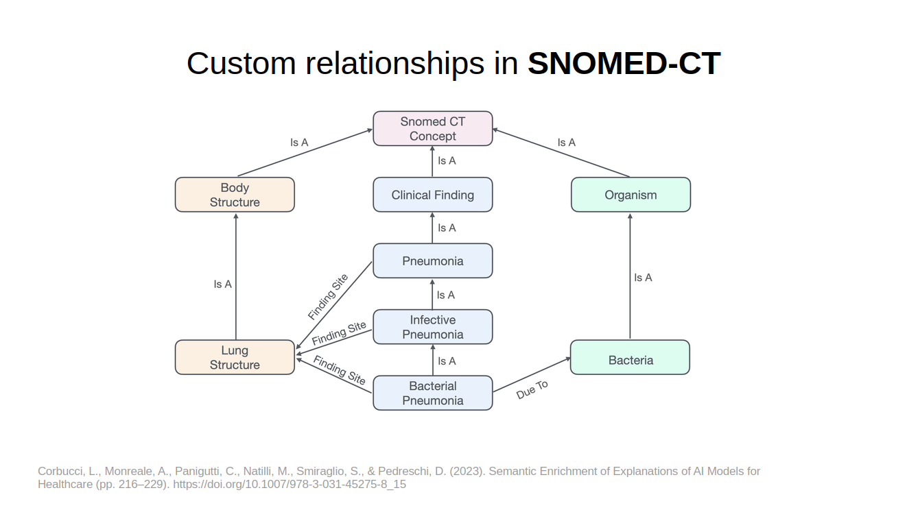
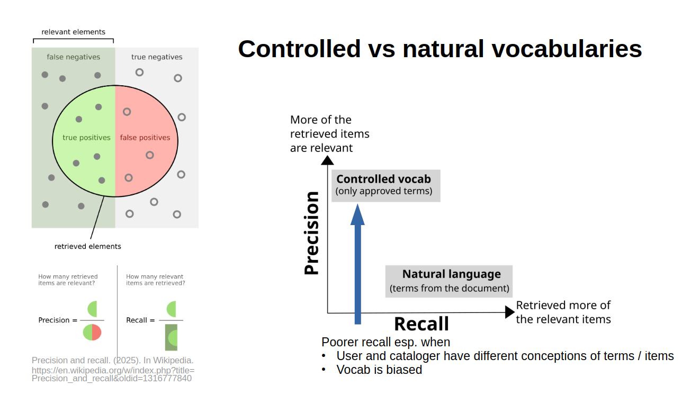

## Analyzing SNOMED-CT as a controlled vocabulary

<!-- background and purpose in bulletpoints -->

## The assignment

The goal of this assignment was to describe and analyze a controlled vocabulary used in the real world.
Rather than outline the minute workings of the vocabulary itself, the idea was to examine its cultural situation in terms of its creation and governance, and to summarize the main weaknesses and strengths of the system.

I chose to focus on the **Systematized Nomenclature of Medicine – Clinical Terms (SNOMED-CT)**.
I chose this particular **ontology** because it is used by Neurobagel for defining diagnoses.
I decided to focus on several aspects of Neurobagel in this course so that I could relate what I was learning to the real world; Neurobagel is developed and maintained by people in the lab where I did my PhD.

Neurobagel is a tool created by my colleagues in my former neuroscience lab. It is “an ecosystem for distributed dataset harmonization and search.” One of its main features is that it allows you to search for individual research subjects across different neuroimaging datasets. For example, below is a screenshot showing how I would use their query tool to search for data from subjects with Parkinson’s disease who are under 51 years old and have had a specific kind of brain scan (T1-Weighted):

## What is SNOMED-CT

SNOWMED-CT claims to be “the global language of healthcare”. It is a multilingual vocabulary including over 360,000 concepts relevant in healthcare (What Is SNOMED CT, n.d.). The purpose is to have a common set of terminology that makes it easier to create and transfer electronic health records. For example, this kind of common language would be essential if we ever wanted to transfer electronic health records across provinces/territories in Canada (this isn’t really possible at the moment).

SNOMED-CT is a health **ontology**. An ontology is similar to a thesaurus, but it has custom types of relationships.
In a thesaurus, the relationships are either generically hierarchical with `BT/NT` (Broad Term / Narrow Term) or generically related with `RT/RT` (Related Terms).
But in an ontology, a hierarchical relationship might be more specific.
For example, you might have something like `Left Atrium IS-IN Lungs`, where `IS-IN` specifically means that the former is physically inside the latter
<!-- (a form of **locative inclusion**). -->
.

Here is a table I made to help myself understand the differences between the types of controlled vocabularies, based on a (more opaque) figure I found in another textbook:

Here's an illustration of some of the custom relationships in SNOMED-CT:

## Background of SNOMED-CT

**Origin**. This vocabulary was created by the “International Health Terminology Standards Development Organization” in 2007 (Our Members, n.d.). I cannot tell whether this organization later became “SNOMED International”, or if“SNOMED International” is under the original organization.

**Ownership and Governance**. SNOMED International works with a membership model, where Members get access to the vocabulary and contribute by approving the budget and strategy. My understanding is that Members are usually national governments. Originally, there were nine charter Members who founded the organization; these members were Australia, Canada, Denmark, Lithuania, Sweden, the Netherlands, New Zealand, the United Kingdom and the United States. They have since expanded to 50 Members across the world (Our Members, n.d.). I cannot find the specific copyright license of SNOMED-CT, but it is clear that one must pay to use it, whether through a national government paying to be a Member or an individual organization paying to get an Affiliate License.

**Maintenance and Change**. Changes can be requested through the Members’ National Release Centers (NRCs), and the process is specific to each country/territory (Change or Add to SNOMED CT, n.d.). In Canada, the organization Canada Health Infoway has a tool called Request for Change (RFC) that can be used to suggest changes. Suggesting a change is a multi-step process with detailed guidelines that must be followed (SNOMED CT/ SNOMED CT CA - Accelero, n.d.). As far as I can tell, there are no modes of public input; one needs to be a part of a workplace that uses the ontology and has the appropriate license.

## Analysis of SNOMED-CT

**Strengths and best use case.** SNOMED-CT lists three main use cases:
  
  1. Clinical settings (e.g., seamlessly transferring electronic health records when a patient moves);
  2. Public health (e.g., monitoring health issues across populations); and
  3. Research and evidence-based healthcare (e.g., linking health records to clinical protocols; What Is SNOMED CT, n.d.)

The main strength of SNOMED-CT is that it is widely-used, customizable, and has many tools built around it.
For example, the fact that many organizations use it helps it fulfill the goal of facilitating transfer of electronic health records.
It also has procedures in place for individual organizations / regions to add region-specific **aliases** (e.g., translations of disease names into the local language).

**Obvious issues.** You can imagine that it takes a lot of work to create and maintain such a large and widely-used vocabulary.
The main critiques that I have encountered stem from the differences between the people creating it (infometricians) and its users (e.g., clinicians).
Some clinicians find it overly complex, requiring time-consuming training.
Further, it may not match their own conceptualizations of diseases as they learned them in medical school.
For example, `depression` is considered to be equivalent to `sadness` in the ontology, but this may not reflect a clinician's understanding or use of the terminology (i.e., it lacks **user warrant**, if we consider the clinicians to be users).

Additionally, there are important cultural differences that are not reflected in the ontology.
For example, `use of cigarettes` is considered to be an instance of `substance abuse`.

**How would you encounter / implement it?** In the context of Neurobagel, the research setting is most important. Referring to the example search above, if we want group together the two subjects with Parkinson’s disease from the “PD De Novo” dataset and the 12 subjects with Parkinson’s disease from the “Quebec Parkinson Network” dataset, we need to be confident that “Parkinson’s Disease” means the same thing in those two datasets.

The Neurobagel team told me that they use SNOMED-CT more like a hierarchical classification system than an ontology.
To them, it is essentially a hierarchy of authority names for diagnoses.
Therefore, the system is arguably overly complex for their purposes, even more so than for many clinicians.
They told me that one of the complaints they hear about the system is that it is too fine-grained; researchers adding their data to the system have to look through many possible diagnoses and variants to find the one that best suits their dataset.

This reflects a particular challenge in Neurobagel: it is regular researchers who are 'cataloguing' their data to the system, and they do not necessarily understand controlled vocabularies in general or SNOMED-CT specifically.
Neurobagel offers support for doing this and they have created a system that makes the process as easy as possible, however, it still requires researchers to look through controlled vocabularies like this to select the best terms.

## References

Change or add to SNOMED CT. (n.d.). SNOMED International. Retrieved November 23, 2025, from [https://www.snomed.org/change-or-add](https://www.snomed.org/change-or-add)

Chatterjee, A. (2017). Controlled Vocabulary (CV). In Elements of Information Organization and Dissemination (pp. 151–169). Elsevier. [https://doi.org/10.1016/B978-0-08-102025-8.00011-9](https://doi.org/10.1016/B978-0-08-102025-8.00011-9)

Corbucci, L., Monreale, A., Panigutti, C., Natilli, M., Smiraglio, S., & Pedreschi, D. (2023). Semantic Enrichment of Explanations of AI Models for Healthcare (pp. 216–229). [https://doi.org/10.1007/978-3-031-45275-8_15](https://doi.org/10.1007/978-3-031-45275-8_15)

Our Members. (n.d.). SNOMED International. Retrieved November 23, 2025, from [https://www.snomed.org/members](https://www.snomed.org/members)

Rossander, A., Lindsköld, L., Ranerup, A., & Karlsson, D. (2021). A State-of-the Art Review of SNOMED CT Terminology Binding and Recommendations for Practice and Research. Methods of Information in Medicine, 60(Suppl 2), e76–e88. [https://doi.org/10.1055/s-0041-1735167](https://doi.org/10.1055/s-0041-1735167)

SNOMED CT/ SNOMED CT CA - Accelero. (n.d.). Retrieved November 23, 2025, from [https://accelero.infoway-inforoute.ca/en/standards/terminology-standards/snomed-ct-snomed-ct-ca](https://accelero.infoway-inforoute.ca/en/standards/terminology-standards/snomed-ct-snomed-ct-ca)

What is SNOMED CT. (n.d.). SNOMED International. Retrieved November 23, 2025, from [https://www.snomed.org/what-is-snomed-ct](https://www.snomed.org/what-is-snomed-ct)

Why SNOMED isn’t enough for complete clinical documentation | IMO Health. (n.d.). <Https://Www.Imohealth.Com/>. Retrieved December 11, 2025, from [https://www.imohealth.com/resources/why-snomed-isnt-enough-for-complete-clinical-documentation/](https://www.imohealth.com/resources/why-snomed-isnt-enough-for-complete-clinical-documentation/)

## Commentary

<!-- Commentary, as little as two sentences. Can be less polished. Can be candid -->

**Version 1: Focus on assignment requirements**

In my initial draft of this assignment, I included all the required points and only added a brief description at the beginning of what is Neurobagel and the role of this ontology in Neurobagel.

**Version 2: Presentation to the Neurobagel team**

My next version was actually a presentation that I prepared for the Neurobagel team. In that presentation, I briefly went over what our controlled vocabularies and the benefits of controlled vocabularies versus natural language for finding resources. While the Neurobagel team might have understood this difference, other people in my lab were there too, and they don't work with these kinds of problems. Here’s the slide I used to briefly summarize the benefits in terms of **precision** and **recall**. The figure on the left is from Wikipedia, and I created the figure on the right:

I also used the table above to explain the different types of controlled vocabularies. Someone from the Neurobagel team said that they thought it was very helpful, since they’ve had a hard time understanding the distinctions.  

I used this presentation as a sort of peer review, instead of submitting it for peer review on our course site on canvas.  These are the questions that I asked them, with a summary of our discussion:

- **Why did you choose SNOMED-CT? Did you consider alternatives?**
  - They looked at what similar tools did, and copied them. Odyssey, a similar tool for observational health, uses SNOMED-CT for diagnoses.
  - They didn't really consider alternatives after discovering it, since it seemed comprehensive and it covered their use case.
- **Do most institutions you work with use SNOMED-CT?**
  - If the 'institution' is a hospital, they probably work with SNOMED-CT.
  - But they are mostly talking to research platforms or individual labs, who haven't heard of SNOMED-CT.
  - Usually, their data contributors use other vocabularies; one of the benefits of SNOMED-CT is that it includes mappings to other vocabularies.
- **What is it like to work with SNOMED-CT?**
  - They have found it 'tricky' and are considering using a different controlled vocabulary for diagnoses.
  - One negative point is that it's not fully open source; technically Neurobagel can't redistribute it, but most Neurobagel users work in license countries so they haven't had too much trouble with their users being able to access it.
  - It's also very large and they don't need the entire thing. They mostly work with the terms under 'Diseases of the central nervous system', which makes sense for a platform sharing neuroimaging data.
  - It's VERY detailed - people have to sift through a lot of sub-diagnoses that are not generally used by the researchers in their studies.
  - It's sometimes too rigid. It's hard to represent qualifiers available in SNOMED-CT, such as sub-clinical patients who have symptoms but don't reach the level of a diagnosis.
  - They had to use another ontology's definition of a "healthy control", since the SNOMED-CT definition didn't fit their use case.
  - They have to remind people that they're annotating with the goal of people finding the data, not finding the perfect term or improving the ontology.

**Version 3: Combining the assignment requirements and my discussion with the Neurobagel Team**

For this final version, I incorporated some explanation of what is an ontology versus a thesaurus, since we didn’t explicitly talk about that in class. I also incorporated some of the points we discussed about during my presentation to the Neurobagel team in the section on "How would you encounter / implement it?".
