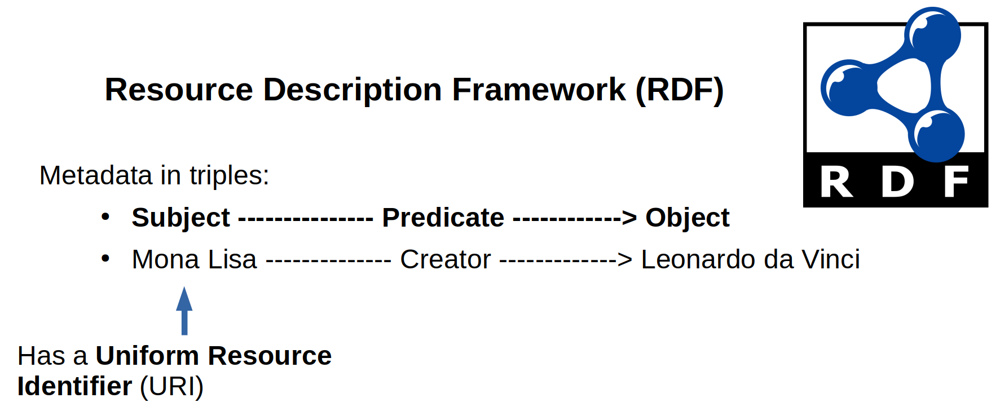
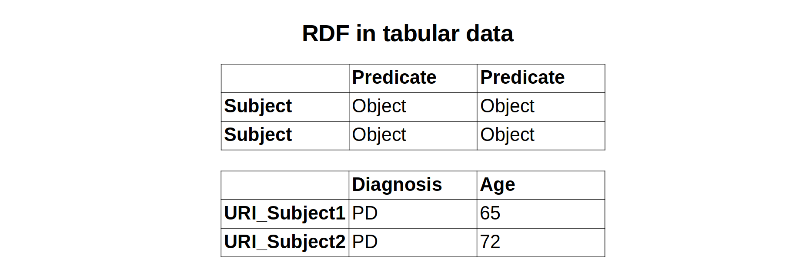
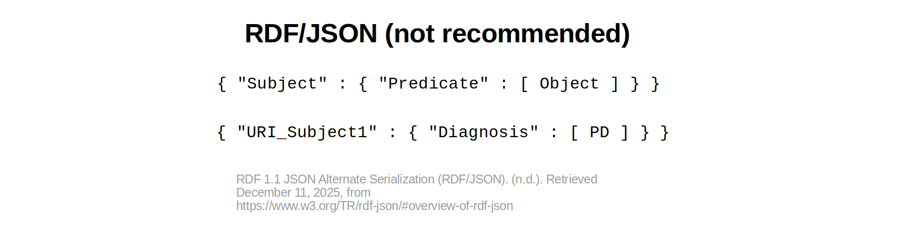
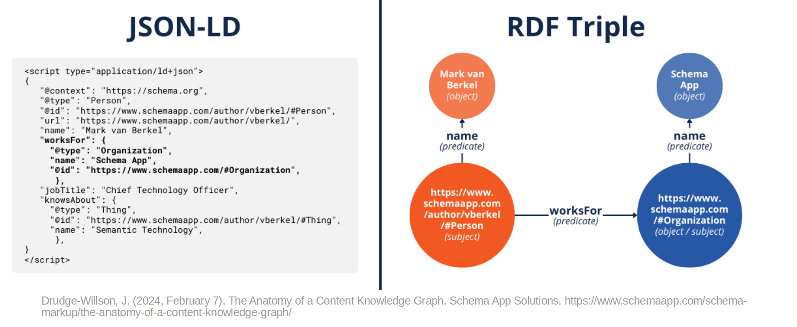
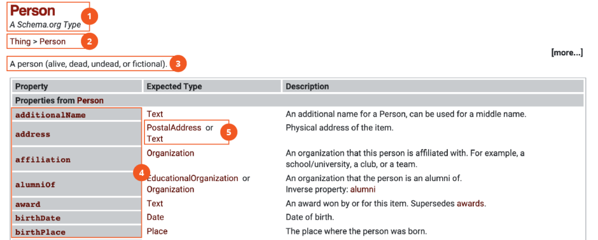
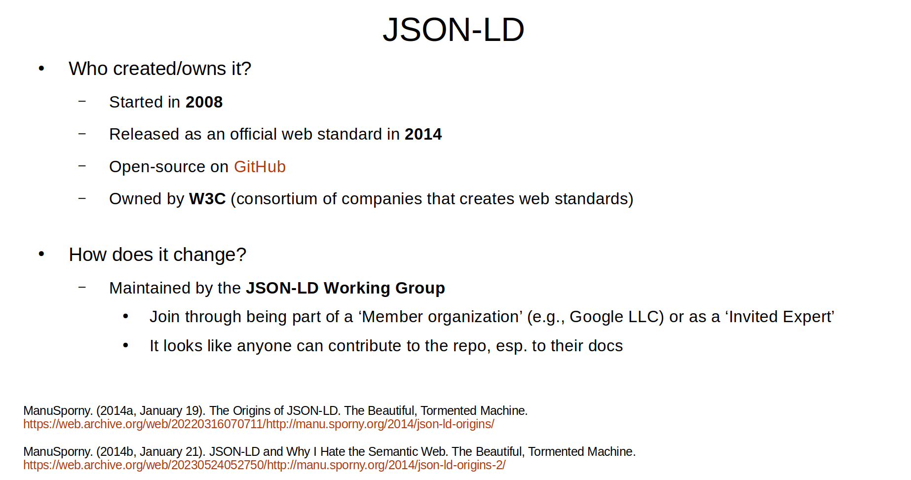
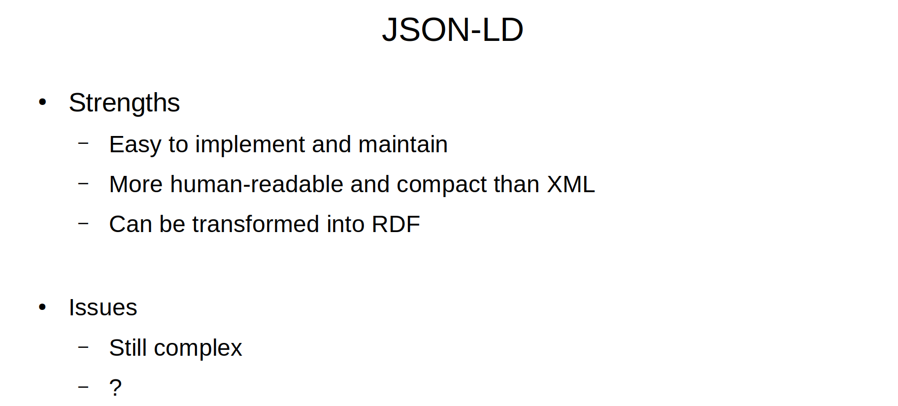
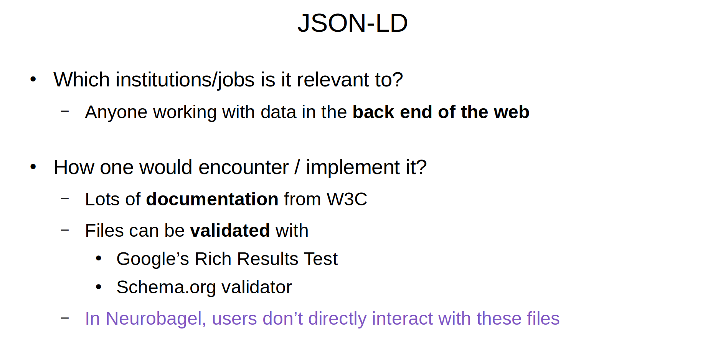

## Analyzing data formats used by Neurobagel

I have discovered the deep, deep rabbit hole of linked data and the semantic web.
Needless to say, I have had to resist researching it too much because I could probably do that for a year and not understand everything.

It all started because I wanted to analyze the data formats used by Neurobagel for this assignment: TSV, JSON, and JSON-LD.
I focused on the latter because that's the format that is actually used to 'catalogue' the human neuroimaging data in the backend of Neurobagel.
Essentially, someone uploading their data to Neurobagel goes through these steps:

1. Data-inputter uploads participant-level phenotypic (non-imaging) data in a **TSV**
2. Data-inputter uploads imaging meta-data in a **JSON**
3. Data-inputter use the **Neurobagel Annotation Tool** (a Graphical User Interface; GUI) to annotate the phenotypic data by matching the terms used to terms from controlled vocabularies (e.g., [diagnoses in SNOMED-CT](../2025-12-05_analyze-controlled-vocabulary_snowmed-ct/index.md))
4. Neurobagel in takes all this data and creates a **JSON-LD** file that populates the graph that is the database in its backend.

Note that I use 'data-inputter' instead of 'user' because there's also another group of 'users' of Neurobagel, the 'data-consumers'.

## The assignment

<!-- first attempt, marked up, or revised version -->
The goal of this assignment was to describe and analyze a data format used for resource discovery in the real world.
Rather than outline the minute workings of the data format itself, the idea was to examine its cultural situation in terms of its creation and governance, and to summarize the main weaknesses and strengths of the system.

I expanded this by writing about the foundational concepts of the Resource Description Framework (RDF) and linked data.

## Foundational concept: Resource Description Framework (RDF)

Resource Description Framework (RDF) is a concept/framework that is supposed to be able to describe anything and any relationship.
It captures things and relationships in **triples**, where two things are the `subject` and `object`, and the relationship between them is the `predicate`.
Each thing has a **Uniform Resource Identifier** (URI, often in the form of a URL) that is unique to that thing.
Here's a slide I made to explain this:

**RDF in tabular data and JSON**

An important thing to understand about RDF is that it is a concept, and it is not tied to a particular syntax or file format (ManuSporny, 2012).

This is a slide I made to demonstrate what RDF might look like in tabular data, such as the TSV file format that Neurobagel data-inputters use to input participant data:

Before JSON-LD became the default format for linked data on the web, **RDF/JSON** was created to write RDF triples in native JSON.
This is challenging/interesting because JSON is based off *key-value pairs*. To make a triple, you need to have a key-value pair embedded in another key-value pair.
Here is the slide I created to explain this:

The website explaining this format explicitly says that it is not recommended, and that JSON-LD should be used instead (RDF 1.1 JSON Alternate Serialization (RDF/JSON), n.d.).

As an introduction to JSON-LD, consider this figure that I found to illustrate how RDF is conceptualized in JSON-LD (Drudge-Willson, 2024):

In order to allow a machine to understand the statement "Mark van Berkel works for Schema App", we need definitions of things like a "Person" and a "Company" and relationships like "name" and "works for".

The figure has these RDF triples shown in a network graph:

- `Person` (subject) `worksFor` (predicate) `Organization` (object)
- `Person` (subject) `name` (predicate) `Mark van Berkel` (object)
- `Organization` (subject) `name` (predicate) `Schema App` (object)

It is interesting to note that JSON-LD was built to be compatible with RDF, but it was not build explicitly for RDF (ManuSporny, 2014a).

## Foundational concept: Linked data

The above figure showing JSON-LD in a graph of RDF Triples is a great segue into the concept of **linked data**.
The machine is able to understand that Mark van Berkel is a person who works for an organization called Schema App because of each of these linked things/nodes and relationships/connections is defined with Uniform Resource Identifiers that link to schemas with the definition of the given thing or relationship.

For example, a "Person" is a specific Type defined at the URL used to identify it.
The following image from [schemaapp.com](https://www.schemaapp.com/schema-markup/guide-to-the-schema-org-vocabulary/) shows how it makes a "Person" understandable to a machine. It is a Type of thing that has these properties (Drudge-Willson, 2023):

1. **Name** of "Person"
2. **Position in hierarchy** below "Thing"
3. **Definition** as "A person (alive, dead, undead, or fictional)"
4. **Properties** like "address" and "birthDate"
5. **Expected types for properties** like "Date" for the property "birthDate".

## Background of JSON-LD

**Basic structure.** JSON-LD is a development on top of the file format JSON (JavaScript Object Notation).
JSON is essentially a set of key-value pairs, usually used for data.
The two most important ways that JSON-LD was extended from JSON for linked data are:

1. A **"context"** is added at the top of the file. This is a set of links to definitions for various things (e.g, "Person") and relationships (e.g, "name").
2. A **unique identifier** for each of the things and relationships.

I created the following slide to illustrate this by marking up a screenshot of JSON-LD code from Wikipedia (“JSON-LD,” 2025):

**Origin and ownership**

- Started in 2008
- Released as an official web standard in 2014
- It is open-source on GitHub
- It is owned by W3C, which is a consortium of companies (e.g., Google LLC, Adobe, etc) that creates web standards

**Maintenance and Change**

- Maintained by the **JSON-LD Working Group**
- One can join through being part of a ‘Member organization (e.g., Google LLC) or as a ‘Invited Expert’
- It looks like anyone can contribute to the repo, esp. to their docs

## Analysis of JSON-LD

**Strengths and best use case.**

- It was developed on a tool (JSON) that was already widely used, making it easier for people to learn and adopt it.
- It is less verbose and complicated than XML, which was previously the primary data format for linked data; it is more human-readable while remaining machine-readable.

**Obvious issues.** Even though it was meant to be more human-readable than XML, it is more complex than basic JSON and requires some explanation.

**How would you encounter / implement it?** Anyone working on the back-ed of the web would likely encounter JSON-LD.
There is a lot of documentation for using it from W3C, and there are several tools that can be used to validate the files, such as Google's Rich Results Test and the schema.org validator.

In Neurobagel, users do not interact with these files.
The users inputting their data ('data-inputters') only interact with TSV and JSON files, along with the Graphical User Interface (GUI) of the Neurobagel Annotation Tool that creates the JSON-LD files.
The users searching for data ('data-consumers') only interact with the Neurobagel Query Tool to find data, and then the downloadable JSON file that contains the meta-data for their search results.

## References

Drudge-Willson, J. (2023, August 17). Guide to the Schema.org Vocabulary. Schema App Solutions. [https://www.schemaapp.com/schema-markup/guide-to-the-schema-org-vocabulary/](https://www.schemaapp.com/schema-markup/guide-to-the-schema-org-vocabulary/)

Drudge-Willson, J. (2024, February 7). The Anatomy of a Content Knowledge Graph. Schema App Solutions. [https://www.schemaapp.com/schema-markup/the-anatomy-of-a-content-knowledge-graph/](https://www.schemaapp.com/schema-markup/the-anatomy-of-a-content-knowledge-graph/)

JSON-LD. (2025). In Wikipedia. [https://en.wikipedia.org/w/index.php?title=JSON-LD&oldid=1307245463](https://en.wikipedia.org/w/index.php?title=JSON-LD&oldid=1307245463)

ManuSporny (Director). (2012, June 18). What is JSON-LD? [Video recording]. [https://www.youtube.com/watch?v=vioCbTo3C-4](https://www.youtube.com/watch?v=vioCbTo3C-4)

ManuSporny. (2014a, January 19). The Origins of JSON-LD. The Beautiful, Tormented Machine. [https://web.archive.org/web/20220316070711/http://manu.sporny.org/2014/json-ld-origins/](https://web.archive.org/web/20220316070711/http://manu.sporny.org/2014/json-ld-origins/)

ManuSporny. (2014b, January 21). JSON-LD and Why I Hate the Semantic Web. The Beautiful, Tormented Machine. [https://web.archive.org/web/20230524052750/http://manu.sporny.org/2014/json-ld-origins-2/](https://web.archive.org/web/20230524052750/http://manu.sporny.org/2014/json-ld-origins-2)

RDF 1.1 JSON Alternate Serialization (RDF/JSON). (n.d.). Retrieved December 11, 2025, from [https://www.w3.org/TR/rdf-json/#overview-of-rdf-json](https://www.w3.org/TR/rdf-json/#overview-of-rdf-json)

## Commentary

<!-- Commentary, as little as two sentences. Can be less polished. Can be candid -->

### Version 1: Slides for presentation to Neurobagel

My original version of this assignment was in the presentation that I made for the Neurobagel team.
That presentation included a brief explanation of RDF, TSV, JSON, and JSON-LD (using the images above).
I presented the assignment requirements in this way:

### Version 2: Adding elements of my discussion with the Neurobagel Team

For this filan version, I wrote out elements of my presentation in a blog format. I also incorporated elements of the discussion I had with the Neurobagel team. Here is a summary of our discussion:

- **Why did you choose these formats? e.g., did you consider XML?**
  - They did not even touch XML.
  - They originally thought the JSON-LD file would be an 'ephemeral file', but they didn't end up using it in that way.
  - They used TSV and JSON as the files that the data-inputter would use because those are the formats used for Brain Imaging Data Standard (BIDS), which is the format for that all the data indexed by Neurobagel.
  - When deciding what to have the data-inputter do versus what to make easier with a graphical user interface, they considered how much complexity should go to the user versus the system.
    - e.g., they decided they wouldn't support all the tabular formats out there; they require the data-inputter to use TSV.
  - They couldn't find great tooling around creating JSON-LD
    - They built their system off the system from the DANDI data archive for making the JSON-LD context and putting it at the top of the file.
  - They could have used other formats for linked data. The graph doesn't care about the format; it can load JSON-LD, Turtle, XML, etc
  - They used something called 'playground' for learning about JSON-LD is great for understanding things
