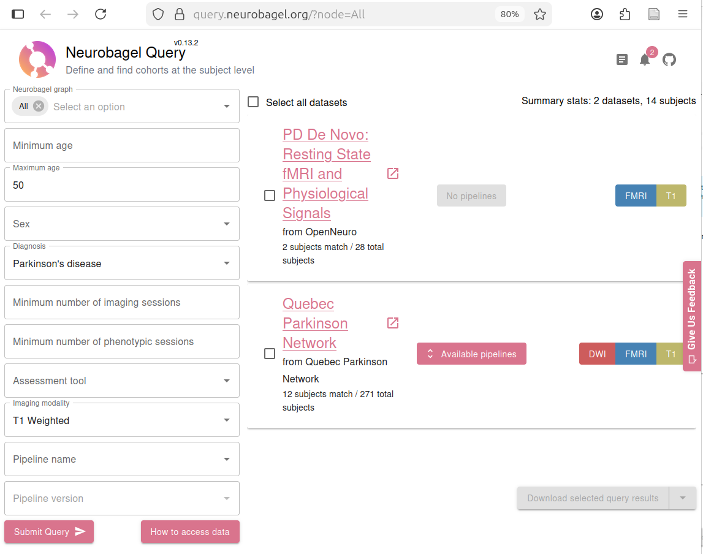
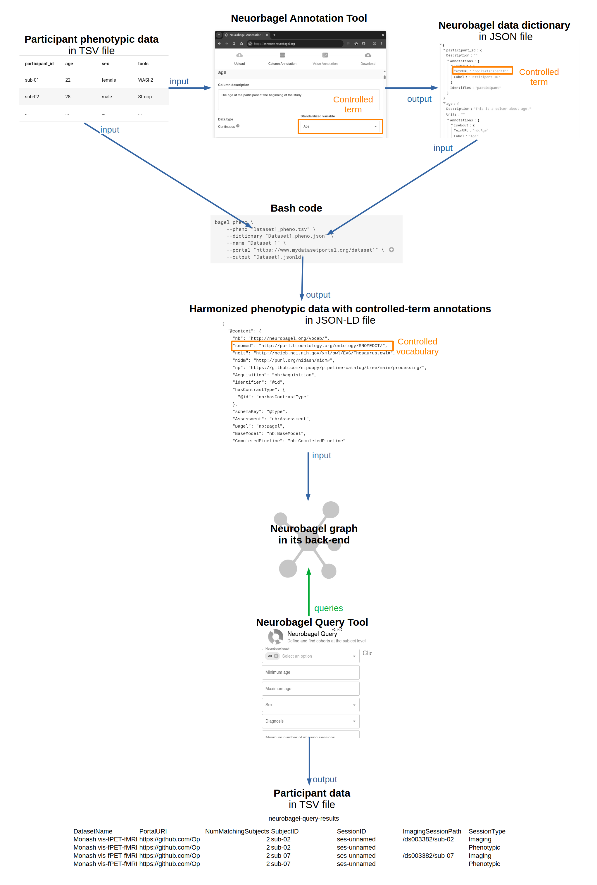
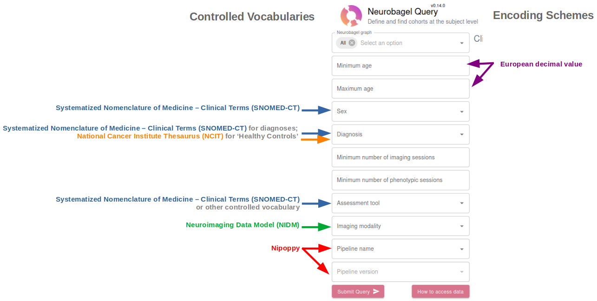

## Analyzing the systems integration in Neurobagel

Before Neurobagel, there were online tools and databases for finding open neuroimaging (brain imaging) datasets.
A huge development in this space was the creation and widespread adoption of the **Brain Imaging Data Structure (BIDS)**, which is a standardized structure for neuroimaging data including designated file formats, directory structures, and metadata files.
This made open brain imaging data more FAIR (Findable, Accessible, Interoperable, and Reusable).

However, if you wanted to combine datasets or parts of datasets, you had to do that manually.
If you wanted to combine datasets of subjects with Parkinson's disease, you would have had to consider whether the label of "Parkinson's disease" in one dataset was equivalent to the label of "Parkinsonisms" in another dataset in order to group together subjects with those labels.
Neurobagel made it possible to search *within* datasets for similar participants, making neuroimaging data even more FAIR.

Combining datasets is an important issue in neuroimaging because we generally struggle with having low statistical power.
In other words, we need *a lot* of data for many questions we want to investigate.
This is extra challenging because it is expensive and time-consuming to collect brain imaging data, and it takes sophisticated hardware, software, and expertise to gather, store, and analyze the data.
Thus, the field as a whole is realizing that we need to distribute the tasks and resources for collecting versus analyzing data so that we can be more efficient and effective overall.
Neurobagel plays an important role in this landscape by facilitating the combining of existing datasets.

## The assignment

For this assignment, we had to pick an existing institution or collection, and analyze the set of systems that it uses to organize resources.
The goal is to see how the different systems interact.

Note that some parts of this assignment are copied or summarized from previous assignments where I analyzed systems used by Neurobagel.

## Background

**What is Neurobagel?** Neurobagel is "an ecosystem for distributed dataset harmonization and search” (*Neurobagel Homepage*, n.d.). One of its main features is that it allows you to search for individual research subjects across different neuroimaging datasets. For example, below is a screenshot showing how I would use their query tool to search for data from subjects with `Parkinson’s disease` who are under `51` years old and have had a specific kind of brain scan (`T1-Weighted`):



This search returns two datasets, the first with two subjects that match the search criteria, and the second with 12 that match.

They currently have indexed 491 datasets, including 33354 individual subjects.

**Who uses Neurobagel?** There are two types of 'users' of Neurobagel:

1. **'Data-inputters'** (my term): users who want to make their data available on Neurobagel and go through the process of inputting and annotating that data throught the **Neurobagel Annotation Tool**; and
2. **'Data-consumers'** (my term): users who want to find data to use for their research via the **Neurobagel Query Tool** (shown in the screenshot above).

**Origins.** Neurobagel was created in 2022 by a group of developers and researchers in the [ORIGAMI Lab](https://neurodatascience.github.io/) at the Montreal Neurological Institute, in collaboration with the Douglas Research Center.
The primary investigator of the ORIGAMI Lab is Dr. Jean-Baptiste Poline, and the core maintainers are Sebastian Urchs, Arman Jahanpour, and Alyssa Dai.

I did my PhD in the ORIGAMI Lab, and while I frequently heard project updates from the Neurobagel team, I was not directly involved in the project other than occasionally testing their user interfaces.

**Maintenance and changes.** While the Neurobagel team is primarily responsible for maintaining the software, they welcome contributions from anyone.
The software is open-source on GitHub, and they have instructions [here](https://neurobagel.org/contributing/CONTRIBUTING/) for how to contribute through GitHub issues and pull requests.

If someone does not have the time or ability to contribute code to the project, they can also open issues with suggestions or provide feedback via the prompts that pop up as you use their online tools.

*NB: Parts of this section are from the previous assignment where I [analyzed Neurobagel's content standard](../2025-12-06_analyze-content-standard_neurobagel/index.md).*

## Neurobagel's integrated systems

I created this figure for myself to understand how the systems work together in Neurobagel:



### Controlled vocabularies and encoding schemes

Neurobagel makes use of several controlled vocabularies and at least one encoding scheme (that I've been able to discover). Here is a screenshot of the **Query Tool** with my annotations of where the various controlled vocabularies come into play when someone searches for data:



These are the controlled vocabularies used and which terms are used in Neurobagel:

- **Systematized Nomenclature of Medicine – Clinical Terms (SNOMED-CT)**, which they used for the definitions of Sex, Diagnoses, and some Assessment Tools. I say 'some' assessment tools because they have decided to allow data-inputters to select a term from *any* controlled vocabulary for their assessment tools, since they weren't able to find a single controlled vocabulary that included all (or even most) of the tools used in the field.
- **National Cancer Institute Thesaurus (NCIT)**, which they used for their definition of 'healthy controls', since it was better suited to their use case than the definition in SNOMED-CT (I learned this from talking to the Neurobagel team).
- **Neuroimaging Data Model (NIDM)**, which they used to define the imaging modalities (e.g., 'T1-weighted' scans from a Magnetic Resonance Imaging (MRI) scanner).
- **Nipoppy**, which they used to define specific preprocessing pipelines that have already been applied to the available data. Nipoppy is another tool created by the ORIGAMI Lab; it is a framework for standardizing the processing of neuroimaging data.

For the "Age" label, they use the encoding scheme **European decimal value**, meaning that decimals should be indicated with commas (as opposed to periods).
I have not asked them why they do this, but it could be because storing values as strings (e.g., '0,07') in JSON ensures exact data transfer, whereas different conversions may change very small values in floats (e.g., 0.07) depending on the level of numeric precision behind the system (dthorpe, 2016).

### Content standard

Neurobagel does not have a content standard in a format like I have seen for bibliographic content standards.
Rather, it has detailed documentation for how to add data to Neurobagel, including how to format the input data in TSV and JSON files.
They also made a Graphical User Interface (GUI) called the Neurobagel Annotation Tool to help data-inputters label their data with controlled vocabularies without having to interact directly with the complicated JSON-LD files that Neurobagel uses in the back-end.

**Neurobagel Annotation Tool**. These are the basic steps that a data-inputter would undertake to label their data with controlled terminology (*Annotating Phenotypic Data - Neurobagel*, n.d.):

1. Upload their tabular data in a TSV
2. Annotate the columns (*predicates* in RDF), including describing the column, selecting the data type (continuous versus categorical), and labelling it with a standardized variable.
3. Annotate specific values (*objects* in RDF), including describing the value (e.g., "male, as reported by the participant") and selecting a standardized term (e.g., "Male") where possible.

For example, this is what it looks like to annotate the value options in a categorical column:


After this process is completed for all columns, the user can download a **Neurobagel data dictionary** in JSON format.
This file contains the specifications for the annotations.

The next step is to run a command to combine the participant TSV with the data dictionary JSON to create the JSON-LD file that is consumed by Neurobagel.
This can be accomplished in Python with a specific command that is easy to adapt (*Generating Harmonized Subject-Level Metadata - Neurobagel*, n.d.):

```bash
bagel pheno \
    --pheno "Dataset1_pheno.tsv" \
    --dictionary "Dataset1_pheno.json" \
    --name "Dataset 1" \
    --portal "https://www.mydatasetportal.org/dataset1" \ 
    --output "Dataset1.jsonld"
```

*NB: Parts of this section are from the previous assignment where I [analyzed Neurobagel's content standard](../2025-12-06_analyze-content-standard_neurobagel/index.md).*

### Data formats

In the back-end, Neurobagel's data is represented in JSON-LD files (explained in [this post on JSON-LD](../2025-12-07_analyze-data-format_neurobagel/index.md)).
The controlled vocabularies are linked in the **context** section of the JSON-LD files like this (*Augmented BIDS Data Dictionaries - Neurobagel*, n.d.):

```json
{
  "@context": {
    "nb": "http://neurobagel.org/vocab/",
    "ncit": "http://ncicb.nci.nih.gov/xml/owl/EVS/Thesaurus.owl#",
    "nidm": "http://purl.org/nidash/nidm#",
    "snomed": "http://purl.bioontology.org/ontology/SNOMEDCT/"
  }
}
```

These links go to web pages with specifications for more-particular items that can be listed in the Neurobagel JSON-LD file.
For example, it can include entries from the Neuroimaging Data Model (NIDM) vocabulary, such as this one for "Group Label":

```turtle
###  http://purl.org/nidash/nidm#groupLabel

nidm:groupLabel rdf:type owl:DatatypeProperty ;

               rdfs:label "Group Label"^^xsd:string ;

               obo:IAO_0000115 "Group label is a property that associates the label used to denote membership in a particular collection with a person or sample."^^xsd:string ;
                       
               obo:IAO_0000114 obo:IAO_0000428 .
```

## Analysis of integration

### From the perspective of Neurobagel 'data-consumers'

To me, it seems very straightforward to use the **Neurobagel Query Tool** to find data.
Its appearance resembles many 'advanced search' options in online stores or even library catalogues, with specified types of input like "Age" and "Diagnosis".

On the one hand, a strength of the Query Tool is that it is easy to use if you know what you're looking for.
On the other hand, it is difficult to 'browse' using this system; it is hard to get a sense of what data is available without a specific search question.
As far as I can tell, the only way to browse or explore the data is by submitting an empty query so that you can see all the results.

### From the perspective of Neurobagel 'data-inputters'

While the Neurobagel team has tried to make it easy to annotate data with controlled vocabularies, a data-inputter still needs to know how to work with TSV and JSON files, as well as how to run some basic code in a Bash shell (to integrate them into JSON-LD files).

From my perspective, as someone with moderate technical expertise, the process looks straightforward and well-documented.
However, based on my experience in the neuroimaging field, I know that many researchers will not have the technical expertise to contribute their data to Neurobagel without learning some new skills and perhaps installing unfamiliar software.

I think the Neurobagel team manages this hurdle by working closely with people/groups who want to contribute data, to guide them through the process.
My impression is that the task of adding data to Neurobagel is usually given to someone with more coding/data experience on a given team; it is not necessary for everyone involved in the research or data collection to be able to do this.

Regarding the use of controlled vocabularies, I think that many researchers in this field will be familiar with the **vocabulary problem**, even if they do not know about specific controlled vocabularies like SNOMED-CT.
Anyone looking to review (formally or informally) research in neuroimaging needs to consider how each study defines the subject matter (e.g., 'working memory') and participant groups (e.g., 'patients' versus 'healthy controls').
This is especially important in clinical research where you are often observing rather than introducing the categories (usually diagnoses).

*NB: Parts of this section are from the previous assignment where I [analyzed Neurobagel's content standard](../2025-12-06_analyze-content-standard_neurobagel/index.md).*

## References

*Annotating phenotypic data—Neurobagel*. (n.d.). Retrieved December 15, 2025, from [https://neurobagel.org/user_guide/annotation_tool/](https://neurobagel.org/user_guide/annotation_tool/)

*Augmented BIDS data dictionaries—Neurobagel*. (n.d.). Retrieved December 15, 2025, from [https://neurobagel.org/data_models/dictionaries/](https://neurobagel.org/data_models/dictionaries/)

dthorpe. (2016, July 13). Answer to “Why would you use a string in JSON to represent a decimal number” [Online post]. *Stack Overflow*. [https://stackoverflow.com/a/38357877](https://stackoverflow.com/a/38357877)

*Generating harmonized subject-level metadata—Neurobagel*. (n.d.). Retrieved December 15, 2025, from [https://neurobagel.org/user_guide/cli/](https://neurobagel.org/user_guide/cli/)

*Neurobagel Homepage*. (n.d.). Neurobagel. Retrieved December 15, 2025, from [https://neurobagel.org/](https://neurobagel.org/)

## Commentary

This assignment is quite long, partly because it incorporates some of the text in the previous assignment where I [analyzed Neurobagel's content standard](../2025-12-06_analyze-content-standard_neurobagel/index.md).
I noted this explicitly in each section where I used text from the previous assignment.
I chose to have this material repeated because I want each post to stand on its own.
In the future, when I'm done this course and I no longer need one post per assignment, I will probably combine some of the posts.
For example, I'll probably integrate the 'Analyze - content standard' assignment and this assignment.

I did not have this assignment ready before I did my presentation to the Neurobagel team.
But I did have an idea of the various systems involved, and we discussed aspects of their Query Tool (for data-consumers).
Below are the questions I asked them and my summaries of their answers. I integrated some aspects of this discussion to expand the post above beyond the assignment requirements.

**Regarding the Query Tool, would you ever want to implement a search system that takes free-text searches?**

- Yes, it's a project for next year

**Are there additional systems that you want to integrate? Cognitive Atlas?**

- They have had to expand beyond using SNOMED-CT to define assessments (e.g., diagnostic tests). They have found that there are just so many assessments out there - they're not captured in any one vocabulary.
  - To address this, data-inputters can create their own community vocabularies or select controlled terms from any controlled vocabulary

### Future directions

I could improve my figure showing how the systems work together.
Ideally it would all fit on one screen, so I may need to re-think the layout.
I asked the Neurobagel team for feedback on its accuracy, and they said the only thing perhaps missing/misleading is that the Neurobagel Query Tool does not directly query the graph; it goes through an API first. This is an important security level because not all of the data in the graph can be shared openly.

On a related note, I would love to explore how these systems were designed to accommodate the different levels of openness of different datasets.
Some datasets are available to anyone (who follows their copyright requirements), but some require some sort of permission/authentication to access.
I think this adds an interesting layer to the design of resource discovery tools.
