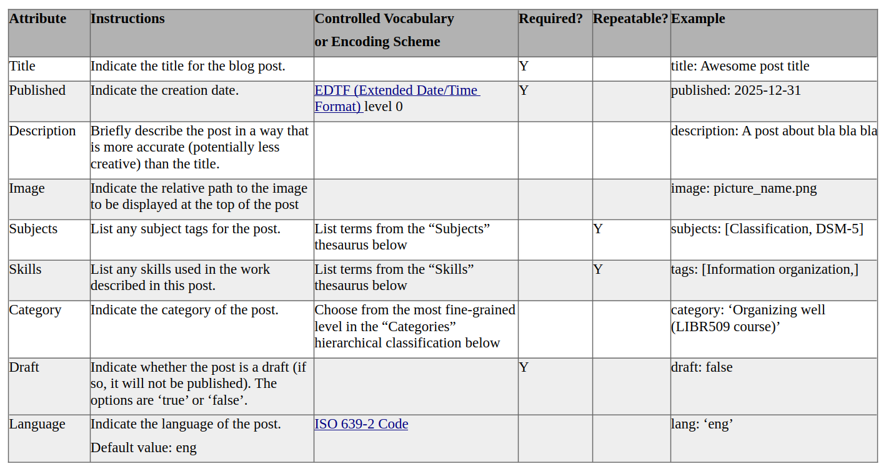
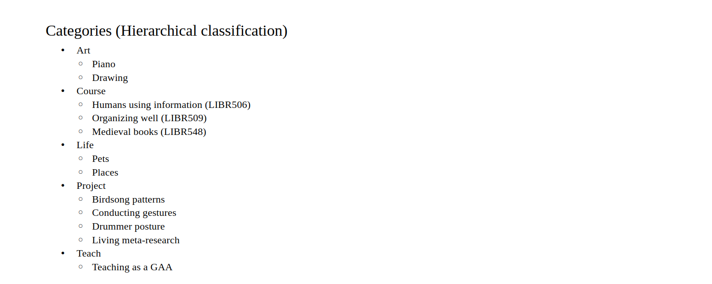
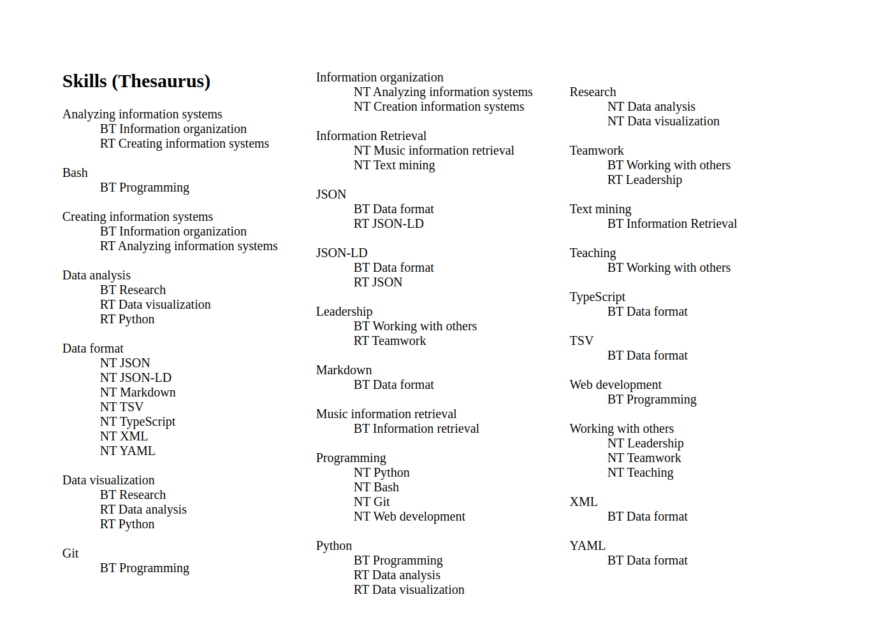
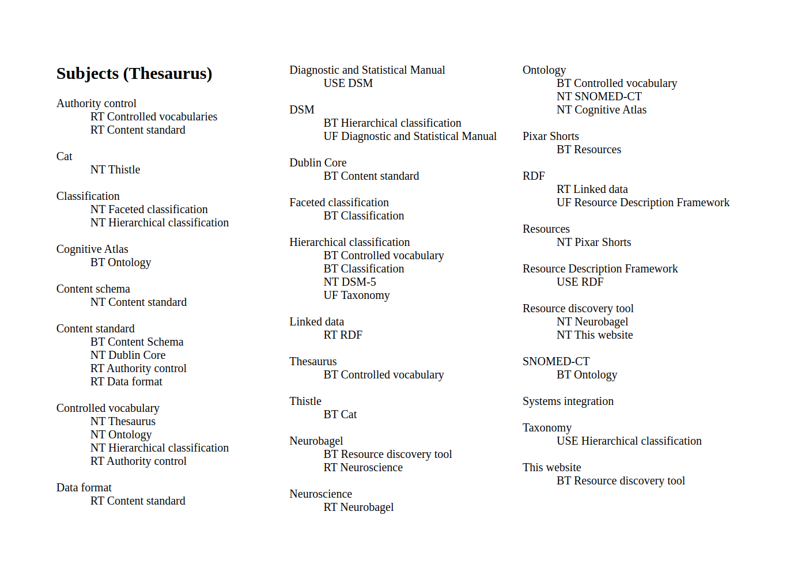
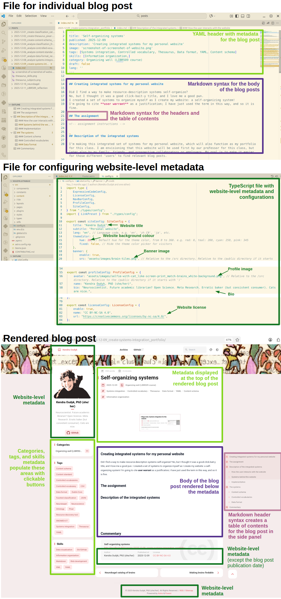

## Creating integrated systems for my personal website

Did I find a way to make resource-description systems self-organize?
No, but I thought it was a good click-bait-y title, and I love me a good pun.
I created a set of systems to organize myself as I create my website: a self-organizing system!
I'm going to cite **user warrant** as a justification; I have just used the term in this way, and so it is fine.

## The assignment

<!-- assignment instructions -->

## Description of the integrated systems

### What are the things being organized, and who will use them?

I’m making this integrated set of systems for my personal website, which will also function as my portfolio for this class.
I am envisioning that this website will be used first by our professor for this class, but later also by my family, friends, and prospective collaborators or employers.
My goal is to make it easier for those different ‘users’ to find relevant blog posts.

These systems will organize blog posts, which will be about things like coursework, research projects, original art, teaching, and life. To start with, I’m focusing on posts about coursework.
So, if you’re curious and look at my “Subjects” thesaurus below, you may notice that there are many terms related to this course, but there aren’t any terms related to my art.

Currently, there are 9 posts, one for each assignment for LIBR509.

### How the user can interact with the website

- On my home page, posts are listed vertically in chronological order, with the most recent at the top. For each post, you can see the title, the description, some metadata (like the date), and the image used at the start of the post.
- On the left side bar below my bio, there are three sets of clickable buttons (like tags): (1) Categories, (2) Subjects, and (3) Skills. Clicking one of the buttons makes it so only the posts with those tags are listed. For example, under Skills, you can click on the button “Data visualization” to find posts that involved using that skill.
- At the top right, there’s a search bar, which searches the body of the blog posts.

### Systems behind the website

- **Blog-post metadata items.** There are 9 metadata fields that I can input for each blog post: `Title`, `Published`, `Description`, `Image`, `Subjects`, `Skills`, `Category`, `Draft`, and `Language`.
- **Hierarchical classification.** I select one `Category` from the finest-grained level of a custom hierarchical classification system (e.g., under “Course”, I could choose “Organizing well (LIBR509)”).
- **Thesauri.** For the `Subjects` and `Skills`, I can choose terms from custom thesauri. I chose to create my own vocabularies rather than use existing ones, since I want to force myself to minimize the number of buttons that people have to look through. I’ll probably make the subject terms for this course more generic after this course is finished; for the portfolio assignment, I thought it would be helpful to have granularity to the level of things like ‘faceted’ vs ‘hierarchical’ classifications, but I think it would be sufficient to have a term like ‘Information organization’ for future users.
- **Content schema.** I created a content schema for inputting the website metadata, but I do not think it is really necessary because it is so straightforward and I’m the only one who will be working on it.
- **Authority control.** Technically, I could input any strings I want for the `Category`, `Subjects`, or `Skills` on a blog post, and the strings would show up on my home page as clickable buttons. If there were more people contributing to the website or if my vocabularies expanded dramatically, I would probably write some additional code to check that the metadata entered follow the rules of the content schema. I haven’t tried this yet, but I think I could write a script in Python to check the terms and then create something called a “git hook” that will make the Python script run automatically when I start the process of pushing a post from my computer to the web. There’s probably a better way to do it in a web development language, but I’m still new to web development.
- **Data format.** Each blog post is a Markdown (.md) file with the metadata included in the same file as a YAML header (between the two sets of three dashes). YAML is a minimalistic markup language (“YAML,” 2025); it’s easy to use even if you don’t know YAML (I didn’t know until 20 seconds ago that the header was YAML, and I’ve already used). The website-level metadata is contained in a TypeScript (.ts) file. TypeScript builds on the JavaScript web programming language (JavaScript With Syntax For Types., n.d.).

### Implementation

The open code behind my website can be found at [https://github.com/koudyk/koudyk.github.io](https://github.com/koudyk/koudyk.github.io), and the original template that I built on is from [https://github.com/saicaca/fuwari](https://github.com/saicaca/fuwari). The main thing that I have added to the website functionality is the additional set of tag-buttons under “Skills” (originally, it only had “Categories” and “Tags”). This was quite challenging to add, since I’m still fairly new to web development.  In the future, I might want to have other sets of tag-buttons for things that might be interesting to future employers/collaborators, like “Research” and “Teaching”.

## The systems

### Content schema

### Controlled vocabularies

### Data format

## References

JavaScript With Syntax For Types. (n.d.). Retrieved December 16, 2025, from [https://www.typescriptlang.org/](https://www.typescriptlang.org/)

YAML. (2025). In Wikipedia. [https://en.wikipedia.org/w/index.php?title=YAML&oldid=1326020622](https://en.wikipedia.org/w/index.php?title=YAML&oldid=1326020622)

## Commentary

<!-- Commentary, as little as two sentences. Can be less polished. Can be candid -->

### Version 1: Submitted version

In my original submitted version, I included appendices with first drafts of the content standard, three vocabularies (categories, subjects, and skills), and screenshots of a blog-post markdown file with its rendering on the website.
I told the peer reviewers that they could ignore the appendices, since it put my assignment way over the word limit, but several of them did look at them.

### Version 2: Expanded version

In the final version, I expanded several sections.
In particular, I spent a lot of time thinking about how to visually show how the file formats behind this website render the blog posts.
I wanted to focus on this because I thought it might be helpful for anyone (e.g., future LIBR509 students) who might want to use the same website template as me.

I also updated the controlled vocabularies.
Some peer reviewers mentioned that they had a hard time understanding the difference between 'Subjects' and 'Skills'.
I think I differentiate them as

- **Subjects**: concepts I *understand*
- **Skills**: things I can *do* or tools I can *use*

With this in mind, I moved the specific file formats (e.g., "JSON-LD") from the "Subjects" thesaurus to the "Skills" thesaurus.

### Future improvements

I am still thinking about how best to display and organize the categories and tags in the left side panel of the website.
After trying to add the "Skills" tags, I realized that it is quite difficult to implement these kinds of changes, and they may even go against some higher-level web schemas that I don't understand yet.

Perhaps it would be easier to leave the "Categories" and "Tags" sections in the back-end, and just change how they are displayed on the front-end.
I think that the simplest change (simple conceptually) would be to turn the list of tags into a **tag cloud**, such that the terms that have been used more often appear larger.
This could make them more useful and less overwhelming to look through.

At the recommendation of a TA for this course, I may add an additional date element to the metadata that is something like `Last updated`, since that will not always be the same as the `Published` date.
