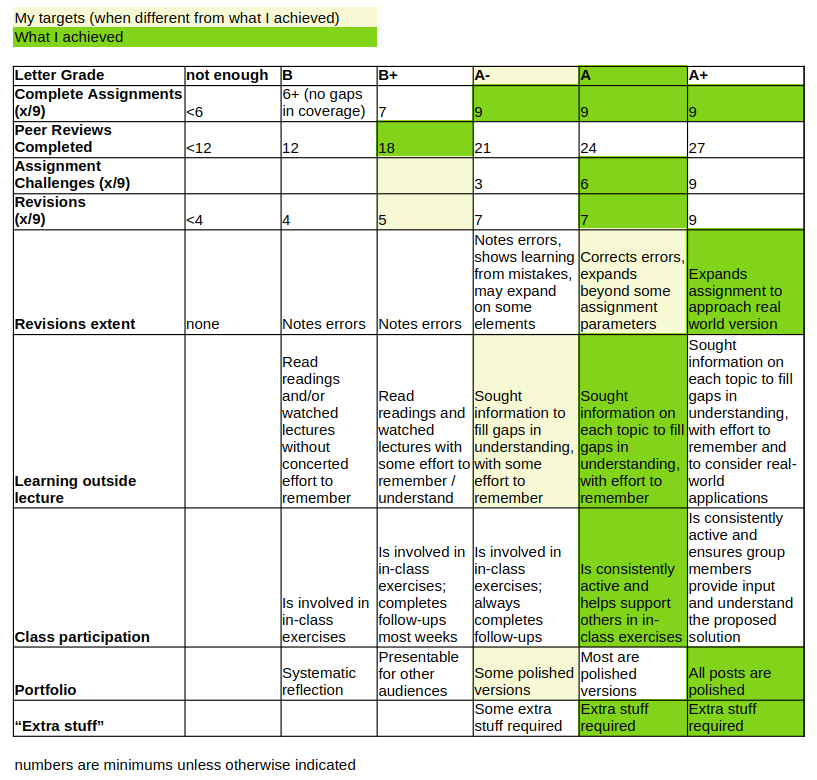
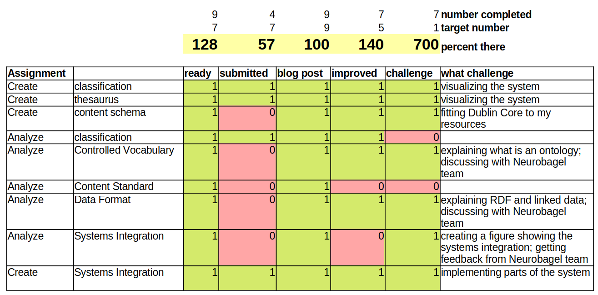
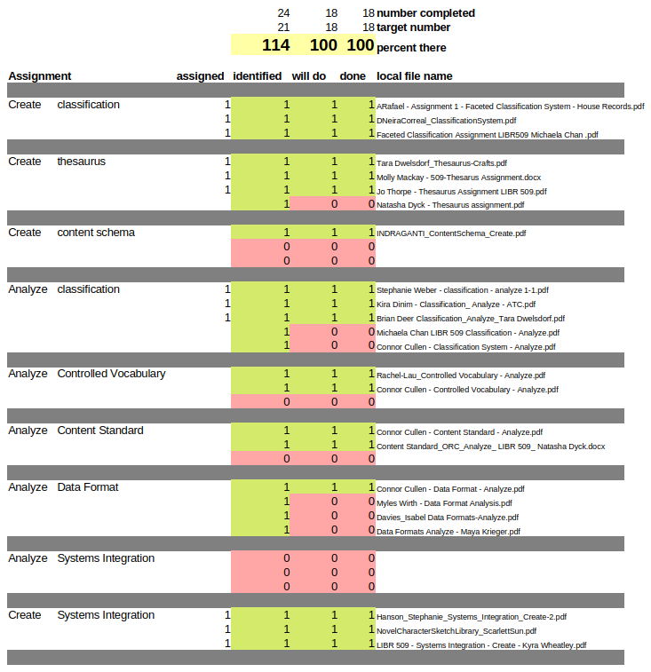

**This is my reflection on the course LIBR 509: Foundations of Resource Description and Knowledge Organization.**

## What do I think I was supposed to get out of this course?

Here is my rough classification scheme for what I saw as the learning outcomes from the course:

- **At the mechanical level**, we learned about specific types of systems and their components, and specific instances of systems.
  - E.g., we learned the mechanics of faceted classification systems and thesauri, some specific systems used in the real world.
- **At a historical level**, we gained a general understanding of how types of systems and particular systems have evolved over time.
  - E.g., libraries seem to have dominated this field historically, but in the more-recent past, computer-related fields have become more involved or have worked on related topics in a parallel manner. As resources moved online, classification-type descriptions became arguably less important than labels like subject headings.
- **At a conceptual level**, we have come to understand the types of problems that are important in this field.
  - E.g., the vocabulary problem and authority control are important whenever we want to standardize the way people use terms.
- **At a contextual level**, we have also considered how various systems are situated in user groups (including patrons and catalogers) and institutions, and the biases that can arise from the context in which systems are created and maintained.
  - E.g., systems that originated in predominantly-Christian areas may under-represent religions other than Christianity.
- **At a functional/meta level**, we have practiced giving and receiving feedback, as well as keeping track of and carefully considering our progress through tasks and our mastery of the content.

## Where am I now?

I believe I have mastered all the basic content of this course, and I have gone deeper than the course required into certain areas that I’m interested in.

**When I encountered concepts I didn’t understand** or felt I was lacking a cohesive picture of how things fit together, I did extra research outside the course materials.
For example, I was having a tough time understanding the distinct types of controlled vocabularies, for example, wondering why SNOMED-CT is an ontology instead of a thesaurus.
So, I did extra research online and came across a textbook with a helpful chapter about controlled vocabularies (Chatterjee, 2017).
There was one figure in particular that I found helpful, but I did not feel the figure itself was remarkably effective, so I recreated the figure and used it several times in my portfolio to highlight the differences between types of controlled vocabularies (e.g., in my [post analyzing SNOMED-CT](http://koudyk.github.io/posts/2025-12-05_analyze-controlled-vocabulary_snowmed-ct/#what-is-snomed-ct)).

**I researched some areas of interest in greater depth** than the course required, such as topics around linked data and the semantic web.
In the end, learning about these topics helped me understand the data format that I analyzed (JSON-LD) I added brief explanations of the [Resource Description Framework](http://koudyk.github.io/posts/2025-12-07_analyze-data-format_neurobagel/#foundational-concept-resource-description-framework-rdf) and [linked data](http://koudyk.github.io/posts/2025-12-07_analyze-data-format_neurobagel/#foundational-concept-linked-data) in my post where I analyzed the data format, both so I could remember it later and in the hopes that other people can better understand JSON-LD if they read my post.

**I intentionally related what I was learning to the real world**.
For example, I used the [create content schema](http://koudyk.github.io/posts/2025-12-03_create-content-schema_website/) and [create systems integration](http://koudyk.github.io/posts/2025-12-09_create-systems-integration_portfolio/) assignments to develop my website.
The website also acted as my portfolio, and I was able to implement some of the systems that I designed.

Another way I linked this course to the real world was choosing to focus on Neurobagel for several of my assignments.
This tool is created by people in my former lab, and I had some basic familiarity with the tool through being an early user tester.
Instead of getting peer reviews for the pieces I wrote about Neurobagel, I asked for feedback from the Neurobagel team.
Preparing the presentation for that meeting also forced me to think about how to explain concepts I was learning about to people who may have learned about similar concepts in a different way (the Neurobagel team is mostly software developers).
I incorporated some of these slides into the blog posts as extra explanations, such as [this slide explaining the basic structure of JSON-LD](https://koudyk.github.io/posts/2025-12-07_analyze-data-format_neurobagel/#background-of-json-ld).

**One area where I feel I could improve** is in my understanding of specific systems in libraries.
Interestingly, by following my natural interests, I somehow avoided any systems used in libraries.
However, one of my possible career goals is to work in an academic library, so I might need to understand those systems in more detail.
I’m not overly worried about this though, because I am genuinely interested in such systems and my background in meta-research has given me a knowledge base that makes it perhaps easier for me to grasp these systems.

In the Appendix, I discuss **topics that I would like to investigate further**, which are outside the scope of this course.

## Justification for my grade

I gave myself my grade based on (a) my mastery of the course topics (as assessed by the tool provided in Canvas) and (b) my performance against the rubric I set for myself.

**Regarding mastery**, I was in the top or second-top category for most of the mastery components in the survey.
The only exception is FRBR, which I felt I understood when working with it in class, but I don't feel that I could explain it on demand now without looking back at my notes.

**Regarding performance**, I have evaluated myself against a rubric that I created several weeks ago.
It is a combination of the collaborative schemes made for this class this year and last year; this is in the first figure below.
Based on my rubric, I set goals for the assignments and peer reviews, and tracked my progress against those goals in the spreadsheets shown in the lower two figures.

I have two special notes about these figures:

1. While I only did 18 peer-reviews, I tried to make the reviews I did more in-depth and helpful than the reviews I was receiving and seeing on Canvas.
2. One more-substantial adaptation I made was to the section "Learning outside lecture". Originally, this section was about completing the readings. But I reflected early in the course that I was struggling with the official textbook. I seem to learn better by finding information to fill specific gaps and interests about different topics, or by reading the glossary of the required textbook instead of the prose-based chapters. I read other textbooks, like most of "Metadata" by Jeffrey Pomerantz (2015) and some of "Elements of Information Organization and Dissemination" by Amitabha Chatterjee (2017). I read many Wikipedia articles and various blogs (e.g., the archived posts from one of the creators of JSON-LD; ManuSporny, 2014). When I teach, I would rather that my students actively seek out information to fill their knowledge gaps in this way, so I decided to make that the performance metric.

### Performance rubric

### Assignments

### Peer-reviews

## Appendix: Topics I want to learn more about

### How linked data might be used in research articles

As I said in the post where I analyzed the data format JSON-LD, I really had to resist going down a rabbit hole exploring linked data and its implementation in different files and systems.
I feel like it holds a lot of promise for making information from research communications more useful, and I’m sure that others have thought of this.

One of my biggest frustrations when doing better research on academic journal articles was the fact that I had to use natural language processing and heuristics to get structured information out of papers, when that information could have easily been included in a machine-readable format at the start.
For example, many journals require you to input the number of participants in your study, but this information is rarely systematically available on their websites.
Further, the ambiguity that comes from research being communicated in natural language allows researchers to stretch the truth to their advantage.
For example, when I was looking at the number of articles included in neuroimaging meta-analysis, I noticed that some papers would list the total number of studies examined in their abstract, say 50 papers, but in the details of the methods section I would discover that they never did a meta-analysis of 50 papers.
They actually did a series of meta-analyses, each with fewer than 50 papers.
Thus, being able to say that they did a meta-analysis on 50 papers in their abstract is slightly misleading and gives the impression that their study had more power than it did.

During my PhD, I thought that the solution would be to have tables with structured data that are both human- and machine-readable about each article.
But after doing this course, I wonder if one could use linked data to communicate this information in natural text, the way that researchers are used to consuming each other’s work, but have the data systematically stored in the back end using linked data.

### Arguments for using user-generated tags rather than controlled vocabularies

For this course, I read the textbook called “Metadata” by Jeffrey Pomerantz (2015), and through looking at his sources, I found a fascinating blog post by Clay Shirky (2005) called "Ontology is Overrated -- Categories, Links, and Tags" .
It is about how, with the internet and the ability to link things directly, we may not need to hold on to certain systems of organizing information like classification and controlled vocabularies.
They suggest that it can be more useful to have many freely input tags assigned by users, rather than a handful of subject headings assigned by expert catalogers.

Again, because my PhD work involved doing meta-research on academic journal articles, I wondered how this could be applied to research.
Of course, most journals require authors to input keywords when they submit their articles, and sometimes they are free to enter whatever they like, that is, they don’t need to use a controlled vocabulary.
But I have found that authors almost always supply keywords related to the *subject* of their research, rather than the *methods*, for example.
Since researchers also almost never mention specific methods in their titles or abstracts, it is very difficult to find a set of papers that use a certain method by using a systematic search string.
If readers could tag papers with information relevant to them, perhaps eventually we would end up with labels for papers that don't just cover subjects.
One thing that I want to look into related to this is whether the Zotero citation management software collects the tags that users give to articles in their collections of papers on their computer.

## References

Chatterjee, A. (2017). Controlled Vocabulary (CV). In *Elements of Information Organization and Dissemination* (pp. 151–169). Elsevier. [https://doi.org/10.1016/B978-0-08-102025-8.00011-9](https://doi.org/10.1016/B978-0-08-102025-8.00011-9)

Chatterjee, A. (2017). *Elements of information organization and dissemination*. Chandos Publishing.

ManuSporny. (2014, January 21). JSON-LD and Why I Hate the Semantic Web. *The Beautiful, Tormented Machine*. [https://web.archive.org/web/20230524052750/http://manu.sporny.org/2014/json-ld-origins-2/](https://web.archive.org/web/20230524052750/http://manu.sporny.org/2014/json-ld-origins-2/)

Pomerantz, J. (2015). *Metadata*. MIT Press.

Shirky, C. (2005). *Ontology is Overrated—Categories, Links, and Tags*. [https://gwern.net/doc/philosophy/ontology/2005-04-shirky-ontologyisoverratedcategorieslinksandtags.html](https://gwern.net/doc/philosophy/ontology/2005-04-shirky-ontologyisoverratedcategorieslinksandtags.html)
